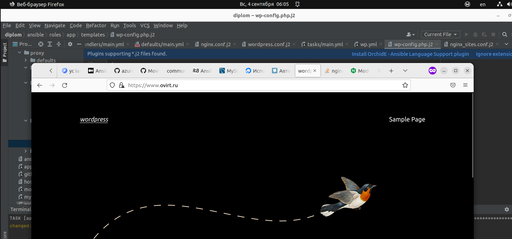

devops-diplom-yandexcloud
# Дипломный практикум в YandexCloud
  * [Цели:](#цели)
  * [Этапы выполнения:](#этапы-выполнения)
      * [Регистрация доменного имени](#регистрация-доменного-имени)
      * [Создание инфраструктуры](#создание-инфраструктуры)
          * [Установка Nginx и LetsEncrypt](#установка-nginx)
          * [Установка кластера MySQL](#установка-mysql)
          * [Установка WordPress](#установка-wordpress)
          * [Установка Gitlab CE, Gitlab Runner и настройка CI/CD](#установка-gitlab)
          * [Установка Prometheus, Alert Manager, Node Exporter и Grafana](#установка-prometheus)
  * [Что необходимо для сдачи задания?](#что-необходимо-для-сдачи-задания)
  * [Как правильно задавать вопросы дипломному руководителю?](#как-правильно-задавать-вопросы-дипломному-руководителю)

---
## Цели:

1. Зарегистрировать доменное имя (любое на ваш выбор в любой доменной зоне).
2. Подготовить инфраструктуру с помощью Terraform на базе облачного провайдера YandexCloud.
3. Настроить внешний Reverse Proxy на основе Nginx и LetsEncrypt.
4. Настроить кластер MySQL.
5. Установить WordPress.
6. Развернуть Gitlab CE и Gitlab Runner.
7. Настроить CI/CD для автоматического развёртывания приложения.
8. Настроить мониторинг инфраструктуры с помощью стека: Prometheus, Alert Manager и Grafana.

---
## Этапы выполнения:

### Регистрация доменного имени

Подойдет любое доменное имя на ваш выбор в любой доменной зоне.

ПРИМЕЧАНИЕ: Далее в качестве примера используется домен `you.domain` замените его вашим доменом.

Рекомендуемые регистраторы:
  - [nic.ru](https://nic.ru)
  - [reg.ru](https://reg.ru)

Цель:

1. Получить возможность выписывать [TLS сертификаты](https://letsencrypt.org) для веб-сервера.

Ожидаемые результаты:

1. У вас есть доступ к личному кабинету на сайте регистратора.
2. Вы зарезистрировали домен и можете им управлять (редактировать dns записи в рамках этого домена).

---

Есть зарегистрированное имя `ovirt.ru` у регистратора `webnames.ru`.


Делегировал его `DNS` на `ns1.yandexcloud.net` и `ns2.yandexcloud.net`, т.к. буду использовать `DNS` от `YC`.

```hcl
resource "yandex_dns_zone" "diplom" {
  name        = "my-diplom-netology-zone"
  description = "Diplom Netology public zone"

  labels = {
    label1 = "diplom-public"
  }

  zone    = "ovirt.ru."
  public  = true
}

resource "yandex_dns_recordset" "def" {
  zone_id = yandex_dns_zone.diplom.id
  name    = "@.ovirt.ru."
  type    = "A"
  ttl     = 200
  data    = [yandex_vpc_address.addr.external_ipv4_address[0].address]
}

resource "yandex_dns_recordset" "gitlab" {
  zone_id = yandex_dns_zone.diplom.id
  name    = "gitlab.ovirt.ru."
  type    = "A"
  ttl     = 200
  data    = [yandex_vpc_address.addr.external_ipv4_address[0].address]
}

resource "yandex_dns_recordset" "alertmanager" {
  zone_id = yandex_dns_zone.diplom.id
  name    = "alertmanager.ovirt.ru."
  type    = "A"
  ttl     = 200
  data    = [yandex_vpc_address.addr.external_ipv4_address[0].address]
}

resource "yandex_dns_recordset" "grafana" {
  zone_id = yandex_dns_zone.diplom.id
  name    = "grafana.ovirt.ru."
  type    = "A"
  ttl     = 200
  data    = [yandex_vpc_address.addr.external_ipv4_address[0].address]
}

resource "yandex_dns_recordset" "prometheus" {
  zone_id = yandex_dns_zone.diplom.id
  name    = "prometheus.ovirt.ru."
  type    = "A"
  ttl     = 200
  data    = [yandex_vpc_address.addr.external_ipv4_address[0].address]
}

resource "yandex_dns_recordset" "www" {
  zone_id = yandex_dns_zone.diplom.id
  name    = "www.ovirt.ru."
  type    = "A"
  ttl     = 200
  data    = [yandex_vpc_address.addr.external_ipv4_address[0].address]
}
```


Так же буду арендовать статический ip у YC автоматически.

```hcl
resource "yandex_vpc_address" "addr" {
  name = "ip-${terraform.workspace}"
  external_ipv4_address {
    zone_id = "ru-central1-a"
  }
}
```


---

### Создание инфраструктуры

Для начала необходимо подготовить инфраструктуру в YC при помощи [Terraform](https://www.terraform.io/).

Особенности выполнения:

- Бюджет купона ограничен, что следует иметь в виду при проектировании инфраструктуры и использовании ресурсов;
- Следует использовать последнюю стабильную версию [Terraform](https://www.terraform.io/).

Предварительная подготовка:

1. Создайте сервисный аккаунт, который будет в дальнейшем использоваться Terraform для работы с инфраструктурой с необходимыми и достаточными правами. Не стоит использовать права суперпользователя
2. Подготовьте [backend](https://www.terraform.io/docs/language/settings/backends/index.html) для Terraform:
   а. Рекомендуемый вариант: [Terraform Cloud](https://app.terraform.io/)  
   б. Альтернативный вариант: S3 bucket в созданном YC аккаунте.
3. Настройте [workspaces](https://www.terraform.io/docs/language/state/workspaces.html)
   а. Рекомендуемый вариант: создайте два workspace: *stage* и *prod*. В случае выбора этого варианта все последующие шаги должны учитывать факт существования нескольких workspace.  
   б. Альтернативный вариант: используйте один workspace, назвав его *stage*. Пожалуйста, не используйте workspace, создаваемый Terraform-ом по-умолчанию (*default*).
4. Создайте VPC с подсетями в разных зонах доступности.
5. Убедитесь, что теперь вы можете выполнить команды `terraform destroy` и `terraform apply` без дополнительных ручных действий.
6. В случае использования [Terraform Cloud](https://app.terraform.io/) в качестве [backend](https://www.terraform.io/docs/language/settings/backends/index.html) убедитесь, что применение изменений успешно проходит, используя web-интерфейс Terraform cloud.

Цель:

1. Повсеместно применять IaaC подход при организации (эксплуатации) инфраструктуры.
2. Иметь возможность быстро создавать (а также удалять) виртуальные машины и сети. С целью экономии денег на вашем аккаунте в YandexCloud.

Ожидаемые результаты:

1. Terraform сконфигурирован и создание инфраструктуры посредством Terraform возможно без дополнительных ручных действий.
2. Полученная конфигурация инфраструктуры является предварительной, поэтому в ходе дальнейшего выполнения задания возможны изменения.

---

Использовал сервисны аккаунт из лабораторных работ - `my-netology`.

Бекенд подготавливаю отдельным конфигом терраформа [s3](scripts/terraform/s3/), 
а затем уже использую его в основном [stage](scripts/terraform/stage), т.к. не вышло его сразу и создать и использовать в одном конфиге.

Использую один воркспейс `stage`.

`VPC` в разных зонах доступности, настроена маршрутизация:

```hcl
resource "yandex_vpc_route_table" "route-table" {
  name                    = "nat-instance-route"
  network_id              = "${yandex_vpc_network.default.id}"
  static_route {
    destination_prefix    = "0.0.0.0/0"
    next_hop_address      = var.lan_proxy_ip
  }
}

resource "yandex_vpc_subnet" "net-101" {
  name = "subnet-${terraform.workspace}-101"
  zone           = "ru-central1-a"
  network_id     = "${yandex_vpc_network.default.id}"
  v4_cidr_blocks = ["192.168.101.0/24"]
  route_table_id          = yandex_vpc_route_table.route-table.id
}

resource "yandex_vpc_subnet" "net-102" {
  name = "subnet-${terraform.workspace}-102"
  zone           = "ru-central1-b"
  network_id     = "${yandex_vpc_network.default.id}"
  v4_cidr_blocks = ["192.168.102.0/24"]
  route_table_id          = yandex_vpc_route_table.route-table.id
}
```

Конфигурации terraform [тут](scripts/terraform/), в процессе могут измениться.

Сначала из каталога `s3`, для создания бакета в `YC`

```bash
export YC_TOKEN=$(yc config get token)
terraform init
terraform plan
terraform apply --auto-approve
```

Далее из каталога `stage`

```bash
export YC_TOKEN=$(yc config get token)
terraform init
terraform workspace new stage
terraform init
terraform plan
terraform apply --auto-approve
terraform output -json > output.json
```

По итогу - создаются 7 виртуальных машин (6 - `Ubuntu 22.04`, proxy - `ubuntu 18.04 NAT Instance`).

Создаются сеть и две подсети `192.168.101.0/24` и `192.168.102.0/24`.

Настраиваются маршруты между ними.

Арендуется белый IP.

Прописываются `DNS` `YC` в соответствии с заданием.

В `output.json` выводится информацию о всех выданных `ip` адресах, для дальнейшего использования с `Ansible`.

Состояние воркспейса `stage` сохраняется в `S3` бакете `YC`.

По завершении не забыть удалить всё, сначала в каталоге `stage` затем в `s3`.

```bash
terraform destroy --auto-approve
```

Содержимое `output.tf` вывожу в `output.json`, хочу автоматизировать заполнение хостов и шаблонов для `Ansible`. 

Пока не нашел как передать системную переменную в файл с хостами `Ansible`.

Как вариант:

[https://900913.ru/tldr/common/en/envsubst/](https://900913.ru/tldr/common/en/envsubst/)

> Replace environment variables in an input file and output to a file:
> 
> `envsubst < {{path/to/input_file}} > {{path/to/output_file}}`


И потом в шаблонах (тот же конфиг `nginx`) забирать `{{ hostvars.alias.ansible_host }}`

---

---
### Установка Nginx и LetsEncrypt

Необходимо разработать Ansible роль для установки Nginx и LetsEncrypt.

**Для получения LetsEncrypt сертификатов во время тестов своего кода пользуйтесь [тестовыми сертификатами](https://letsencrypt.org/docs/staging-environment/), так как количество запросов к боевым серверам LetsEncrypt [лимитировано](https://letsencrypt.org/docs/rate-limits/).**

Рекомендации:
  - Имя сервера: `you.domain`
  - Характеристики: 2vCPU, 2 RAM, External address (Public) и Internal address.

Цель:

1. Создать reverse proxy с поддержкой TLS для обеспечения безопасного доступа к веб-сервисам по HTTPS.

Ожидаемые результаты:

1. В вашей доменной зоне настроены все A-записи на внешний адрес этого сервера:
    - `https://www.you.domain` (WordPress)
    - `https://gitlab.you.domain` (Gitlab)
    - `https://grafana.you.domain` (Grafana)
    - `https://prometheus.you.domain` (Prometheus)
    - `https://alertmanager.you.domain` (Alert Manager)
2. Настроены все upstream для выше указанных URL, куда они сейчас ведут на этом шаге не важно, позже вы их отредактируете и укажите верные значения.
2. В браузере можно открыть любой из этих URL и увидеть ответ сервера (502 Bad Gateway). На текущем этапе выполнение задания это нормально!

---

Тут использовал данные материалы:

https://github.com/coopdevs/certbot_nginx

https://github.com/geerlingguy/ansible-role-certbot/

Работает


---

___
### Установка кластера MySQL

Необходимо разработать Ansible роль для установки кластера MySQL.

Рекомендации:
  - Имена серверов: `db01.you.domain` и `db02.you.domain`
  - Характеристики: 4vCPU, 4 RAM, Internal address.

Цель:

1. Получить отказоустойчивый кластер баз данных MySQL.

Ожидаемые результаты:

1. MySQL работает в режиме репликации Master/Slave.
2. В кластере автоматически создаётся база данных c именем `wordpress`.
3. В кластере автоматически создаётся пользователь `wordpress` с полными правами на базу `wordpress` и паролем `wordpress`.

**Вы должны понимать, что в рамках обучения это допустимые значения, но в боевой среде использование подобных значений не приемлимо! Считается хорошей практикой использовать логины и пароли повышенного уровня сложности. В которых будут содержаться буквы верхнего и нижнего регистров, цифры, а также специальные символы!**

---

Репликация работает, что использовал:

[https://medium.com/@kelom.x/ansible-mysql-installation-2513d0f70faf](https://medium.com/@kelom.x/ansible-mysql-installation-2513d0f70faf)

[https://github.com/geerlingguy/ansible-role-mysql/blob/master/tasks/replication.yml](https://github.com/geerlingguy/ansible-role-mysql/blob/master/tasks/replication.yml)

[https://handyhost.ru/manuals/mysql/mysql-replication.html](https://handyhost.ru/manuals/mysql/mysql-replication.html)

---

___
### Установка WordPress

Необходимо разработать Ansible роль для установки WordPress.

Рекомендации:
  - Имя сервера: `app.you.domain`
  - Характеристики: 4vCPU, 4 RAM, Internal address.

Цель:

1. Установить [WordPress](https://wordpress.org/download/). Это система управления содержимым сайта ([CMS](https://ru.wikipedia.org/wiki/Система_управления_содержимым)) с открытым исходным кодом.


По данным W3techs, WordPress используют 64,7% всех веб-сайтов, которые сделаны на CMS. Это 41,1% всех существующих в мире сайтов. Эту платформу для своих блогов используют The New York Times и Forbes. Такую популярность WordPress получил за удобство интерфейса и большие возможности.

Ожидаемые результаты:

1. Виртуальная машина на которой установлен WordPress и Nginx/Apache (на ваше усмотрение).
2. В вашей доменной зоне настроена A-запись на внешний адрес reverse proxy:
    - `https://www.you.domain` (WordPress)
3. На сервере `you.domain` отредактирован upstream для выше указанного URL и он смотрит на виртуальную машину на которой установлен WordPress.
4. В браузере можно открыть URL `https://www.you.domain` и увидеть главную страницу WordPress.

---

`Wordpress` работает, использовал `nginx`.



[https://habr.com/ru/post/223073/](https://habr.com/ru/post/223073/)

[https://www.digitalocean.com/community/tutorials/how-to-use-ansible-to-install-and-set-up-wordpress-with-lamp-on-ubuntu-18-04-ru](https://www.digitalocean.com/community/tutorials/how-to-use-ansible-to-install-and-set-up-wordpress-with-lamp-on-ubuntu-18-04-ru)

[https://www.techbeginner.in/2021/01/how-to-install-php-using-ansible.html](https://www.techbeginner.in/2021/01/how-to-install-php-using-ansible.html)

---

---
### Установка Gitlab CE и Gitlab Runner

Необходимо настроить CI/CD систему для автоматического развертывания приложения при изменении кода.

Рекомендации:
  - Имена серверов: `gitlab.you.domain` и `runner.you.domain`
  - Характеристики: 4vCPU, 4 RAM, Internal address.

Цель:
1. Построить pipeline доставки кода в среду эксплуатации, то есть настроить автоматический деплой на сервер `app.you.domain` при коммите в репозиторий с WordPress.

Подробнее об [Gitlab CI](https://about.gitlab.com/stages-devops-lifecycle/continuous-integration/)

Ожидаемый результат:

1. Интерфейс Gitlab доступен по https.
2. В вашей доменной зоне настроена A-запись на внешний адрес reverse proxy:
    - `https://gitlab.you.domain` (Gitlab)
3. На сервере `you.domain` отредактирован upstream для выше указанного URL и он смотрит на виртуальную машину на которой установлен Gitlab.
3. При любом коммите в репозиторий с WordPress и создании тега (например, v1.0.0) происходит деплой на виртуальную машину.

---

Использую данную роль, немного изменив

[https://github.com/geerlingguy/ansible-role-gitlab](https://github.com/geerlingguy/ansible-role-gitlab)

[https://github.com/andrelohmann/ansible-role-gitlab](https://github.com/andrelohmann/ansible-role-gitlab)

[https://docs.gitlab.com/ee/administration/environment_variables.html](https://docs.gitlab.com/ee/administration/environment_variables.html)

Долго мучался, т.к. ставил Ubuntu 22.04, получал ошибку

```bash
TASK [gitlab : Install GitLab] ********************************************************************************************************************************************************
fatal: [gitlab.ovirt.ru]: FAILED! => {"ansible_job_id": "129742348762.35918", "changed": false, "finished": 1, "msg": "No package matching 'gitlab-ce' is available"}

PLAY RECAP ****************************************************************************************************************************************************************************
gitlab.ovirt.ru            : ok=7    changed=1    unreachable=0    failed=1    skipped=1    rescued=0    ignored=0   
```

Рано ее еще ставить, 20.04 нужно пока что:

[https://gitlab.com/gitlab-org/gitlab/-/issues/364673](https://gitlab.com/gitlab-org/gitlab/-/issues/364673)

---

___
### Установка Prometheus, Alert Manager, Node Exporter и Grafana

Необходимо разработать Ansible роль для установки Prometheus, Alert Manager и Grafana.

Рекомендации:
  - Имя сервера: `monitoring.you.domain`
  - Характеристики: 4vCPU, 4 RAM, Internal address.

Цель:

1. Получение метрик со всей инфраструктуры.

Ожидаемые результаты:

1. Интерфейсы Prometheus, Alert Manager и Grafana доступены по https.
2. В вашей доменной зоне настроены A-записи на внешний адрес reverse proxy:
  - `https://grafana.you.domain` (Grafana)
  - `https://prometheus.you.domain` (Prometheus)
  - `https://alertmanager.you.domain` (Alert Manager)
3. На сервере `you.domain` отредактированы upstreams для выше указанных URL и они смотрят на виртуальную машину на которой установлены Prometheus, Alert Manager и Grafana.
4. На всех серверах установлен Node Exporter и его метрики доступны Prometheus.
5. У Alert Manager есть необходимый [набор правил](https://awesome-prometheus-alerts.grep.to/rules.html) для создания алертов.
2. В Grafana есть дашборд отображающий метрики из Node Exporter по всем серверам.
3. В Grafana есть дашборд отображающий метрики из MySQL (*).
4. В Grafana есть дашборд отображающий метрики из WordPress (*).

*Примечание: дашборды со звёздочкой являются опциональными заданиями повышенной сложности их выполнение желательно, но не обязательно.*

---

[https://medium.com/devops4me/install-grafana-prometheus-node-exporter-using-ansible-1771e649a4b3](https://medium.com/devops4me/install-grafana-prometheus-node-exporter-using-ansible-1771e649a4b3)

[https://github.com/cloudalchemy/ansible-node-exporter](https://github.com/cloudalchemy/ansible-node-exporter)

---

---
## Что необходимо для сдачи задания?

1. Репозиторий со всеми Terraform манифестами и готовность продемонстрировать создание всех ресурсов с нуля.
2. Репозиторий со всеми Ansible ролями и готовность продемонстрировать установку всех сервисов с нуля.
3. Скриншоты веб-интерфейсов всех сервисов работающих по HTTPS на вашем доменном имени.
  - `https://www.you.domain` (WordPress)
  - `https://gitlab.you.domain` (Gitlab)
  - `https://grafana.you.domain` (Grafana)
  - `https://prometheus.you.domain` (Prometheus)
  - `https://alertmanager.you.domain` (Alert Manager)
4. Все репозитории рекомендуется хранить на одном из ресурсов ([github.com](https://github.com) или [gitlab.com](https://gitlab.com)).

---
## Как правильно задавать вопросы дипломному руководителю?

**Что поможет решить большинство частых проблем:**

1. Попробовать найти ответ сначала самостоятельно в интернете или в
  материалах курса и ДЗ и только после этого спрашивать у дипломного
  руководителя. Навык поиска ответов пригодится вам в профессиональной
  деятельности.
2. Если вопросов больше одного, то присылайте их в виде нумерованного
  списка. Так дипломному руководителю будет проще отвечать на каждый из
  них.
3. При необходимости прикрепите к вопросу скриншоты и стрелочкой
  покажите, где не получается.

**Что может стать источником проблем:**

1. Вопросы вида «Ничего не работает. Не запускается. Всё сломалось». Дипломный руководитель не сможет ответить на такой вопрос без дополнительных уточнений. Цените своё время и время других.
2. Откладывание выполнения курсового проекта на последний момент.
3. Ожидание моментального ответа на свой вопрос. Дипломные руководители работающие разработчики, которые занимаются, кроме преподавания, своими проектами. Их время ограничено, поэтому постарайтесь задавать правильные вопросы, чтобы получать быстрые ответы :)
