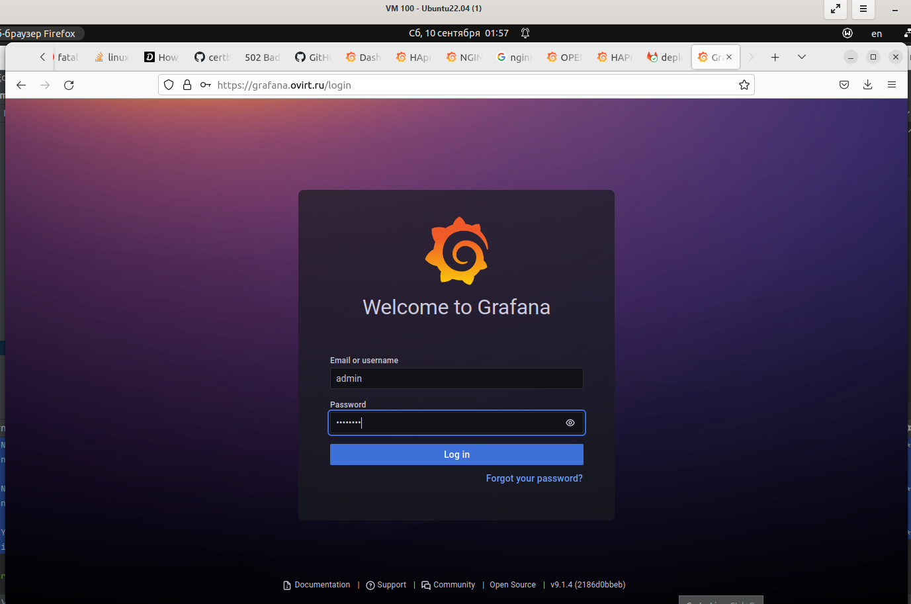
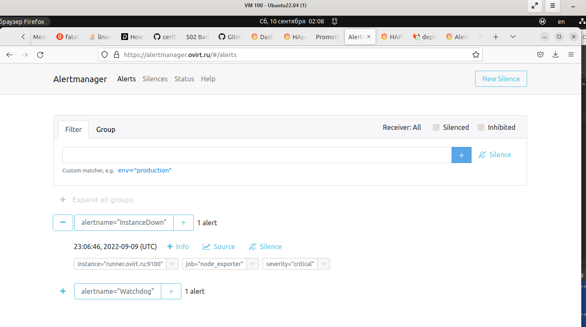

devops-diplom-yandexcloud
# Дипломный практикум в YandexCloud
  * [Цели:](#цели)
  * [Этапы выполнения:](#этапы-выполнения)
      * [Регистрация доменного имени](#регистрация-доменного-имени)
      * [Создание инфраструктуры](#создание-инфраструктуры)
          * [Установка Nginx и LetsEncrypt](#установка-nginx)
          * [Установка кластера MySQL](#установка-mysql)
          * [Установка WordPress](#установка-wordpress)
          * [Установка Gitlab CE, Gitlab Runner и настройка CI/CD](#установка-gitlab)
          * [Установка Prometheus, Alert Manager, Node Exporter и Grafana](#установка-prometheus)
  * [Что необходимо для сдачи задания?](#что-необходимо-для-сдачи-задания)
  * [Как правильно задавать вопросы дипломному руководителю?](#как-правильно-задавать-вопросы-дипломному-руководителю)

---
## Цели:

1. Зарегистрировать доменное имя (любое на ваш выбор в любой доменной зоне).
2. Подготовить инфраструктуру с помощью Terraform на базе облачного провайдера YandexCloud.
3. Настроить внешний Reverse Proxy на основе Nginx и LetsEncrypt.
4. Настроить кластер MySQL.
5. Установить WordPress.
6. Развернуть Gitlab CE и Gitlab Runner.
7. Настроить CI/CD для автоматического развёртывания приложения.
8. Настроить мониторинг инфраструктуры с помощью стека: Prometheus, Alert Manager и Grafana.

---
## Этапы выполнения:

### Регистрация доменного имени

Подойдет любое доменное имя на ваш выбор в любой доменной зоне.

ПРИМЕЧАНИЕ: Далее в качестве примера используется домен `you.domain` замените его вашим доменом.

Рекомендуемые регистраторы:
  - [nic.ru](https://nic.ru)
  - [reg.ru](https://reg.ru)

Цель:

1. Получить возможность выписывать [TLS сертификаты](https://letsencrypt.org) для веб-сервера.

Ожидаемые результаты:

1. У вас есть доступ к личному кабинету на сайте регистратора.
2. Вы зарезистрировали домен и можете им управлять (редактировать dns записи в рамках этого домена).

---

Есть зарегистрированное имя `ovirt.ru` у регистратора `webnames.ru`.


Делегировал его `DNS` на `ns1.yandexcloud.net` и `ns2.yandexcloud.net`, т.к. буду использовать `DNS` от `YC`.

```hcl
resource "yandex_dns_zone" "diplom" {
  name        = "my-diplom-netology-zone"
  description = "Diplom Netology public zone"

  labels = {
    label1 = "diplom-public"
  }

  zone    = "ovirt.ru."
  public  = true

  depends_on = [
    yandex_vpc_subnet.net-101,yandex_vpc_subnet.net-102
  ]
}

resource "yandex_dns_recordset" "def" {
  zone_id = yandex_dns_zone.diplom.id
  name    = "@.ovirt.ru."
  type    = "A"
  ttl     = 200
  data    = [yandex_vpc_address.addr.external_ipv4_address[0].address]
}

resource "yandex_dns_recordset" "gitlab" {
  zone_id = yandex_dns_zone.diplom.id
  name    = "gitlab.ovirt.ru."
  type    = "A"
  ttl     = 200
  data    = [yandex_vpc_address.addr.external_ipv4_address[0].address]
}

resource "yandex_dns_recordset" "alertmanager" {
  zone_id = yandex_dns_zone.diplom.id
  name    = "alertmanager.ovirt.ru."
  type    = "A"
  ttl     = 200
  data    = [yandex_vpc_address.addr.external_ipv4_address[0].address]
}

resource "yandex_dns_recordset" "grafana" {
  zone_id = yandex_dns_zone.diplom.id
  name    = "grafana.ovirt.ru."
  type    = "A"
  ttl     = 200
  data    = [yandex_vpc_address.addr.external_ipv4_address[0].address]
}

resource "yandex_dns_recordset" "prometheus" {
  zone_id = yandex_dns_zone.diplom.id
  name    = "prometheus.ovirt.ru."
  type    = "A"
  ttl     = 200
  data    = [yandex_vpc_address.addr.external_ipv4_address[0].address]
}

resource "yandex_dns_recordset" "www" {
  zone_id = yandex_dns_zone.diplom.id
  name    = "www.ovirt.ru."
  type    = "A"
  ttl     = 200
  data    = [yandex_vpc_address.addr.external_ipv4_address[0].address]
}
```


Так же буду арендовать статический ip у YC автоматически.

```hcl
resource "yandex_vpc_address" "addr" {
  name = "ip-${terraform.workspace}"
  external_ipv4_address {
    zone_id = "ru-central1-a"
  }
}
```


---

### Создание инфраструктуры

Для начала необходимо подготовить инфраструктуру в YC при помощи [Terraform](https://www.terraform.io/).

Особенности выполнения:

- Бюджет купона ограничен, что следует иметь в виду при проектировании инфраструктуры и использовании ресурсов;
- Следует использовать последнюю стабильную версию [Terraform](https://www.terraform.io/).

Предварительная подготовка:

1. Создайте сервисный аккаунт, который будет в дальнейшем использоваться Terraform для работы с инфраструктурой с необходимыми и достаточными правами. Не стоит использовать права суперпользователя
2. Подготовьте [backend](https://www.terraform.io/docs/language/settings/backends/index.html) для Terraform:
   а. Рекомендуемый вариант: [Terraform Cloud](https://app.terraform.io/)  
   б. Альтернативный вариант: S3 bucket в созданном YC аккаунте.
3. Настройте [workspaces](https://www.terraform.io/docs/language/state/workspaces.html)
   а. Рекомендуемый вариант: создайте два workspace: *stage* и *prod*. В случае выбора этого варианта все последующие шаги должны учитывать факт существования нескольких workspace.  
   б. Альтернативный вариант: используйте один workspace, назвав его *stage*. Пожалуйста, не используйте workspace, создаваемый Terraform-ом по-умолчанию (*default*).
4. Создайте VPC с подсетями в разных зонах доступности.
5. Убедитесь, что теперь вы можете выполнить команды `terraform destroy` и `terraform apply` без дополнительных ручных действий.
6. В случае использования [Terraform Cloud](https://app.terraform.io/) в качестве [backend](https://www.terraform.io/docs/language/settings/backends/index.html) убедитесь, что применение изменений успешно проходит, используя web-интерфейс Terraform cloud.

Цель:

1. Повсеместно применять IaaC подход при организации (эксплуатации) инфраструктуры.
2. Иметь возможность быстро создавать (а также удалять) виртуальные машины и сети. С целью экономии денег на вашем аккаунте в YandexCloud.

Ожидаемые результаты:

1. Terraform сконфигурирован и создание инфраструктуры посредством Terraform возможно без дополнительных ручных действий.
2. Полученная конфигурация инфраструктуры является предварительной, поэтому в ходе дальнейшего выполнения задания возможны изменения.

---

Использовал сервисны аккаунт из лабораторных работ - `my-netology`.

Бекенд подготавливаю отдельным конфигом терраформа [s3](scripts/terraform/s3/), 
а затем уже использую его в основном [stage](scripts/terraform/stage), т.к. не вышло его сразу и создать и использовать в одном конфиге.

Использую один воркспейс `stage`.

`VPC` в разных зонах доступности, настроена маршрутизация:

```hcl
resource "yandex_vpc_network" "default" {
  name = "net-${terraform.workspace}"
}

resource "yandex_vpc_route_table" "route-table" {
  name                    = "nat-instance-route"
  network_id              = "${yandex_vpc_network.default.id}"
  static_route {
    destination_prefix    = "0.0.0.0/0"
    next_hop_address      = var.lan_proxy_ip
  }
}

resource "yandex_vpc_subnet" "net-101" {
  name = "subnet-${terraform.workspace}-101"
  zone           = "ru-central1-a"
  network_id     = "${yandex_vpc_network.default.id}"
  v4_cidr_blocks = ["192.168.101.0/24"]
  route_table_id          = yandex_vpc_route_table.route-table.id
}

resource "yandex_vpc_subnet" "net-102" {
  name = "subnet-${terraform.workspace}-102"
  zone           = "ru-central1-b"
  network_id     = "${yandex_vpc_network.default.id}"
  v4_cidr_blocks = ["192.168.102.0/24"]
  route_table_id          = yandex_vpc_route_table.route-table.id
}
```

Конфигурации terraform [тут](scripts/terraform/), в процессе могут измениться.

Сначала из каталога `s3`, для создания бакета в `YC`

```bash
export YC_TOKEN=$(yc config get token)
terraform init
terraform plan
terraform apply --auto-approve
```

<details>
<summary>Вывод terraform</summary>

```bash

user@user-ubuntu:~/devops/diplom/s3$ terraform init&& terraform plan&& terraform apply -auto-approve

Initializing the backend...

Initializing provider plugins...
- Reusing previous version of yandex-cloud/yandex from the dependency lock file
- Using previously-installed yandex-cloud/yandex v0.78.1

Terraform has been successfully initialized!

You may now begin working with Terraform. Try running "terraform plan" to see
any changes that are required for your infrastructure. All Terraform commands
should now work.

If you ever set or change modules or backend configuration for Terraform,
rerun this command to reinitialize your working directory. If you forget, other
commands will detect it and remind you to do so if necessary.
data.yandex_iam_service_account.my-netology: Reading...
data.yandex_iam_service_account.my-netology: Read complete after 0s [id=ajesg66dg5r1ahte7mqd]

Terraform used the selected providers to generate the following execution plan. Resource actions are indicated with the following symbols:
  + create

Terraform will perform the following actions:

  # yandex_iam_service_account_static_access_key.sa-static-key will be created
  + resource "yandex_iam_service_account_static_access_key" "sa-static-key" {
      + access_key           = (known after apply)
      + created_at           = (known after apply)
      + description          = "static access key for object storage"
      + encrypted_secret_key = (known after apply)
      + id                   = (known after apply)
      + key_fingerprint      = (known after apply)
      + secret_key           = (sensitive value)
      + service_account_id   = "ajesg66dg5r1ahte7mqd"
    }

  # yandex_storage_bucket.state will be created
  + resource "yandex_storage_bucket" "state" {
      + access_key            = (known after apply)
      + acl                   = "private"
      + bucket                = "my-netology-bucket"
      + bucket_domain_name    = (known after apply)
      + default_storage_class = (known after apply)
      + folder_id             = (known after apply)
      + force_destroy         = true
      + id                    = (known after apply)
      + secret_key            = (sensitive value)
      + website_domain        = (known after apply)
      + website_endpoint      = (known after apply)

      + anonymous_access_flags {
          + list = (known after apply)
          + read = (known after apply)
        }

      + versioning {
          + enabled = (known after apply)
        }
    }

Plan: 2 to add, 0 to change, 0 to destroy.

Changes to Outputs:
  + access_key = (sensitive value)
  + secret_key = (sensitive value)

────────────────────────────────────────────────────────────────────────────────────────────────────────────────────────────────────────────────────────────────────────────────

Note: You didn't use the -out option to save this plan, so Terraform can't guarantee to take exactly these actions if you run "terraform apply" now.
data.yandex_iam_service_account.my-netology: Reading...
data.yandex_iam_service_account.my-netology: Read complete after 0s [id=ajesg66dg5r1ahte7mqd]

Terraform used the selected providers to generate the following execution plan. Resource actions are indicated with the following symbols:
  + create

Terraform will perform the following actions:

  # yandex_iam_service_account_static_access_key.sa-static-key will be created
  + resource "yandex_iam_service_account_static_access_key" "sa-static-key" {
      + access_key           = (known after apply)
      + created_at           = (known after apply)
      + description          = "static access key for object storage"
      + encrypted_secret_key = (known after apply)
      + id                   = (known after apply)
      + key_fingerprint      = (known after apply)
      + secret_key           = (sensitive value)
      + service_account_id   = "ajesg66dg5r1ahte7mqd"
    }

  # yandex_storage_bucket.state will be created
  + resource "yandex_storage_bucket" "state" {
      + access_key            = (known after apply)
      + acl                   = "private"
      + bucket                = "my-netology-bucket"
      + bucket_domain_name    = (known after apply)
      + default_storage_class = (known after apply)
      + folder_id             = (known after apply)
      + force_destroy         = true
      + id                    = (known after apply)
      + secret_key            = (sensitive value)
      + website_domain        = (known after apply)
      + website_endpoint      = (known after apply)

      + anonymous_access_flags {
          + list = (known after apply)
          + read = (known after apply)
        }

      + versioning {
          + enabled = (known after apply)
        }
    }

Plan: 2 to add, 0 to change, 0 to destroy.

Changes to Outputs:
  + access_key = (sensitive value)
  + secret_key = (sensitive value)
yandex_iam_service_account_static_access_key.sa-static-key: Creating...
yandex_iam_service_account_static_access_key.sa-static-key: Creation complete after 0s [id=ajevatl8bfcpe66f6s6f]
yandex_storage_bucket.state: Creating...
yandex_storage_bucket.state: Still creating... [10s elapsed]
yandex_storage_bucket.state: Still creating... [20s elapsed]
yandex_storage_bucket.state: Still creating... [30s elapsed]
yandex_storage_bucket.state: Still creating... [40s elapsed]
yandex_storage_bucket.state: Still creating... [50s elapsed]
yandex_storage_bucket.state: Still creating... [1m0s elapsed]
yandex_storage_bucket.state: Creation complete after 1m1s [id=my-netology-bucket]

Apply complete! Resources: 2 added, 0 changed, 0 destroyed.

Outputs:

access_key = <sensitive>
secret_key = <sensitive>


```

</details>


Из файла `terraform.tfstate` берем значения `access_key` и `secret_key` и заносим их в файл `main.tf` каталога `stage`.

Далее из каталога `stage`

```bash
export YC_TOKEN=$(yc config get token)
terraform init
terraform workspace new stage
terraform init
terraform plan
terraform apply --auto-approve
terraform output -json > output.json
```

<details>
<summary>Вывод terraform</summary>

```bash

user@user-ubuntu:~/devops/diplom/stage$ terraform init -reconfigure&& terraform workspace new stage&& terraform init -reconfigure&& terraform plan&& terraform apply --auto-approve&& terraform output -json > output.json

Initializing the backend...

Successfully configured the backend "s3"! Terraform will automatically
use this backend unless the backend configuration changes.

Initializing provider plugins...
- Reusing previous version of yandex-cloud/yandex from the dependency lock file
- Using previously-installed yandex-cloud/yandex v0.78.1

Terraform has been successfully initialized!

You may now begin working with Terraform. Try running "terraform plan" to see
any changes that are required for your infrastructure. All Terraform commands
should now work.

If you ever set or change modules or backend configuration for Terraform,
rerun this command to reinitialize your working directory. If you forget, other
commands will detect it and remind you to do so if necessary.
Created and switched to workspace "stage"!

You're now on a new, empty workspace. Workspaces isolate their state,
so if you run "terraform plan" Terraform will not see any existing state
for this configuration.

Initializing the backend...

Successfully configured the backend "s3"! Terraform will automatically
use this backend unless the backend configuration changes.

Initializing provider plugins...
- Reusing previous version of yandex-cloud/yandex from the dependency lock file
- Using previously-installed yandex-cloud/yandex v0.78.1

Terraform has been successfully initialized!

You may now begin working with Terraform. Try running "terraform plan" to see
any changes that are required for your infrastructure. All Terraform commands
should now work.

If you ever set or change modules or backend configuration for Terraform,
rerun this command to reinitialize your working directory. If you forget, other
commands will detect it and remind you to do so if necessary.
data.yandex_iam_service_account.my-netology: Reading...
data.yandex_iam_service_account.my-netology: Read complete after 0s [id=ajesg66dg5r1ahte7mqd]

Terraform used the selected providers to generate the following execution plan. Resource actions are indicated with the following symbols:
  + create

Terraform will perform the following actions:

  # yandex_compute_instance.app will be created
  + resource "yandex_compute_instance" "app" {
      + allow_stopping_for_update = true
      + created_at                = (known after apply)
      + folder_id                 = (known after apply)
      + fqdn                      = (known after apply)
      + hostname                  = "app.ovirt.ru"
      + id                        = (known after apply)
      + metadata                  = {
          + "user-data" = <<-EOT
                #cloud-config
                users:
                  - name: user
                    groups: sudo
                    shell: /bin/bash
                    sudo: ['ALL=(ALL) NOPASSWD:ALL']
                    ssh_authorized_keys:
                      - ssh-rsa AAAAB3NzaC1yc2EAAAADAQABAAABgQCeOYFLwcOqvWVg6bamtPX/lxjq6wxnI7HBGOkqhusbpZajDbF7OZ0mSAzw4J4xV3rMMW1eimmi/vLTvYh2N91vUegbfleWuh9XfS0Ouv1XYiDiEw1X5wPfj8VwWIIIqSRfCxiO4C7njT+yRfpgJDXLHJ2Oy40c1kmvOPq6fA4zIBpqADAjCcLUS7qv1HIR3+K/v+fiUFUEKSFSKYY7ANsM0ujwjpnPnFpDlDxMkuX/8988zPlwIx2woEJTn8ea9UT0cdkdnIGGO7OVvPW16FoEMbs3ccp9l6Nv8DMFbWhd7Mp4Dkekpj+aLeDvCnQCUtcFZIn6AQ74m5ZwKNISoHZyqWehs7RIOPOEEbmpANEk1l7HZKvV7KvZPh1ucc2wj+prUD1ZRP7meRkwjn6orY80UVm7RP4ENsJYNePgZLmK247JbxVXnT93NpU597F78tOEdqpQPshc0jLDPpQRRfLfT6g3WMxL6yXl3CDiC9yr0FbSOzpcyaH7UsAqLsuozx0= user@user-ubuntu
                
            EOT
        }
      + name                      = "app"
      + network_acceleration_type = "standard"
      + platform_id               = "standard-v1"
      + service_account_id        = (known after apply)
      + status                    = (known after apply)
      + zone                      = "ru-central1-b"

      + boot_disk {
          + auto_delete = true
          + device_name = (known after apply)
          + disk_id     = (known after apply)
          + mode        = (known after apply)

          + initialize_params {
              + block_size  = (known after apply)
              + description = (known after apply)
              + image_id    = "fd8uoiksr520scs811jl"
              + name        = (known after apply)
              + size        = 10
              + snapshot_id = (known after apply)
              + type        = "network-nvme"
            }
        }

      + network_interface {
          + index              = (known after apply)
          + ip_address         = (known after apply)
          + ipv4               = true
          + ipv6               = (known after apply)
          + ipv6_address       = (known after apply)
          + mac_address        = (known after apply)
          + nat                = false
          + nat_ip_address     = (known after apply)
          + nat_ip_version     = (known after apply)
          + security_group_ids = (known after apply)
          + subnet_id          = (known after apply)
        }

      + placement_policy {
          + host_affinity_rules = (known after apply)
          + placement_group_id  = (known after apply)
        }

      + resources {
          + core_fraction = 100
          + cores         = 4
          + memory        = 4
        }

      + scheduling_policy {
          + preemptible = (known after apply)
        }
    }

  # yandex_compute_instance.db01 will be created
  + resource "yandex_compute_instance" "db01" {
      + allow_stopping_for_update = true
      + created_at                = (known after apply)
      + folder_id                 = (known after apply)
      + fqdn                      = (known after apply)
      + hostname                  = "db01.ovirt.ru"
      + id                        = (known after apply)
      + metadata                  = {
          + "user-data" = <<-EOT
                #cloud-config
                users:
                  - name: user
                    groups: sudo
                    shell: /bin/bash
                    sudo: ['ALL=(ALL) NOPASSWD:ALL']
                    ssh_authorized_keys:
                      - ssh-rsa AAAAB3NzaC1yc2EAAAADAQABAAABgQCeOYFLwcOqvWVg6bamtPX/lxjq6wxnI7HBGOkqhusbpZajDbF7OZ0mSAzw4J4xV3rMMW1eimmi/vLTvYh2N91vUegbfleWuh9XfS0Ouv1XYiDiEw1X5wPfj8VwWIIIqSRfCxiO4C7njT+yRfpgJDXLHJ2Oy40c1kmvOPq6fA4zIBpqADAjCcLUS7qv1HIR3+K/v+fiUFUEKSFSKYY7ANsM0ujwjpnPnFpDlDxMkuX/8988zPlwIx2woEJTn8ea9UT0cdkdnIGGO7OVvPW16FoEMbs3ccp9l6Nv8DMFbWhd7Mp4Dkekpj+aLeDvCnQCUtcFZIn6AQ74m5ZwKNISoHZyqWehs7RIOPOEEbmpANEk1l7HZKvV7KvZPh1ucc2wj+prUD1ZRP7meRkwjn6orY80UVm7RP4ENsJYNePgZLmK247JbxVXnT93NpU597F78tOEdqpQPshc0jLDPpQRRfLfT6g3WMxL6yXl3CDiC9yr0FbSOzpcyaH7UsAqLsuozx0= user@user-ubuntu
                
            EOT
        }
      + name                      = "db01"
      + network_acceleration_type = "standard"
      + platform_id               = "standard-v1"
      + service_account_id        = (known after apply)
      + status                    = (known after apply)
      + zone                      = "ru-central1-b"

      + boot_disk {
          + auto_delete = true
          + device_name = (known after apply)
          + disk_id     = (known after apply)
          + mode        = (known after apply)

          + initialize_params {
              + block_size  = (known after apply)
              + description = (known after apply)
              + image_id    = "fd8uoiksr520scs811jl"
              + name        = (known after apply)
              + size        = 10
              + snapshot_id = (known after apply)
              + type        = "network-nvme"
            }
        }

      + network_interface {
          + index              = (known after apply)
          + ip_address         = (known after apply)
          + ipv4               = true
          + ipv6               = (known after apply)
          + ipv6_address       = (known after apply)
          + mac_address        = (known after apply)
          + nat                = false
          + nat_ip_address     = (known after apply)
          + nat_ip_version     = (known after apply)
          + security_group_ids = (known after apply)
          + subnet_id          = (known after apply)
        }

      + placement_policy {
          + host_affinity_rules = (known after apply)
          + placement_group_id  = (known after apply)
        }

      + resources {
          + core_fraction = 100
          + cores         = 4
          + memory        = 4
        }

      + scheduling_policy {
          + preemptible = (known after apply)
        }
    }

  # yandex_compute_instance.db02 will be created
  + resource "yandex_compute_instance" "db02" {
      + allow_stopping_for_update = true
      + created_at                = (known after apply)
      + folder_id                 = (known after apply)
      + fqdn                      = (known after apply)
      + hostname                  = "db02.ovirt.ru"
      + id                        = (known after apply)
      + metadata                  = {
          + "user-data" = <<-EOT
                #cloud-config
                users:
                  - name: user
                    groups: sudo
                    shell: /bin/bash
                    sudo: ['ALL=(ALL) NOPASSWD:ALL']
                    ssh_authorized_keys:
                      - ssh-rsa AAAAB3NzaC1yc2EAAAADAQABAAABgQCeOYFLwcOqvWVg6bamtPX/lxjq6wxnI7HBGOkqhusbpZajDbF7OZ0mSAzw4J4xV3rMMW1eimmi/vLTvYh2N91vUegbfleWuh9XfS0Ouv1XYiDiEw1X5wPfj8VwWIIIqSRfCxiO4C7njT+yRfpgJDXLHJ2Oy40c1kmvOPq6fA4zIBpqADAjCcLUS7qv1HIR3+K/v+fiUFUEKSFSKYY7ANsM0ujwjpnPnFpDlDxMkuX/8988zPlwIx2woEJTn8ea9UT0cdkdnIGGO7OVvPW16FoEMbs3ccp9l6Nv8DMFbWhd7Mp4Dkekpj+aLeDvCnQCUtcFZIn6AQ74m5ZwKNISoHZyqWehs7RIOPOEEbmpANEk1l7HZKvV7KvZPh1ucc2wj+prUD1ZRP7meRkwjn6orY80UVm7RP4ENsJYNePgZLmK247JbxVXnT93NpU597F78tOEdqpQPshc0jLDPpQRRfLfT6g3WMxL6yXl3CDiC9yr0FbSOzpcyaH7UsAqLsuozx0= user@user-ubuntu
                
            EOT
        }
      + name                      = "db02"
      + network_acceleration_type = "standard"
      + platform_id               = "standard-v1"
      + service_account_id        = (known after apply)
      + status                    = (known after apply)
      + zone                      = "ru-central1-b"

      + boot_disk {
          + auto_delete = true
          + device_name = (known after apply)
          + disk_id     = (known after apply)
          + mode        = (known after apply)

          + initialize_params {
              + block_size  = (known after apply)
              + description = (known after apply)
              + image_id    = "fd8uoiksr520scs811jl"
              + name        = (known after apply)
              + size        = 10
              + snapshot_id = (known after apply)
              + type        = "network-nvme"
            }
        }

      + network_interface {
          + index              = (known after apply)
          + ip_address         = (known after apply)
          + ipv4               = true
          + ipv6               = (known after apply)
          + ipv6_address       = (known after apply)
          + mac_address        = (known after apply)
          + nat                = false
          + nat_ip_address     = (known after apply)
          + nat_ip_version     = (known after apply)
          + security_group_ids = (known after apply)
          + subnet_id          = (known after apply)
        }

      + placement_policy {
          + host_affinity_rules = (known after apply)
          + placement_group_id  = (known after apply)
        }

      + resources {
          + core_fraction = 100
          + cores         = 4
          + memory        = 4
        }

      + scheduling_policy {
          + preemptible = (known after apply)
        }
    }

  # yandex_compute_instance.gitlab will be created
  + resource "yandex_compute_instance" "gitlab" {
      + allow_stopping_for_update = true
      + created_at                = (known after apply)
      + folder_id                 = (known after apply)
      + fqdn                      = (known after apply)
      + hostname                  = "gitlab.ovirt.ru"
      + id                        = (known after apply)
      + metadata                  = {
          + "user-data" = <<-EOT
                #cloud-config
                users:
                  - name: user
                    groups: sudo
                    shell: /bin/bash
                    sudo: ['ALL=(ALL) NOPASSWD:ALL']
                    ssh_authorized_keys:
                      - ssh-rsa AAAAB3NzaC1yc2EAAAADAQABAAABgQCeOYFLwcOqvWVg6bamtPX/lxjq6wxnI7HBGOkqhusbpZajDbF7OZ0mSAzw4J4xV3rMMW1eimmi/vLTvYh2N91vUegbfleWuh9XfS0Ouv1XYiDiEw1X5wPfj8VwWIIIqSRfCxiO4C7njT+yRfpgJDXLHJ2Oy40c1kmvOPq6fA4zIBpqADAjCcLUS7qv1HIR3+K/v+fiUFUEKSFSKYY7ANsM0ujwjpnPnFpDlDxMkuX/8988zPlwIx2woEJTn8ea9UT0cdkdnIGGO7OVvPW16FoEMbs3ccp9l6Nv8DMFbWhd7Mp4Dkekpj+aLeDvCnQCUtcFZIn6AQ74m5ZwKNISoHZyqWehs7RIOPOEEbmpANEk1l7HZKvV7KvZPh1ucc2wj+prUD1ZRP7meRkwjn6orY80UVm7RP4ENsJYNePgZLmK247JbxVXnT93NpU597F78tOEdqpQPshc0jLDPpQRRfLfT6g3WMxL6yXl3CDiC9yr0FbSOzpcyaH7UsAqLsuozx0= user@user-ubuntu
                
            EOT
        }
      + name                      = "gitlab"
      + network_acceleration_type = "standard"
      + platform_id               = "standard-v1"
      + service_account_id        = (known after apply)
      + status                    = (known after apply)
      + zone                      = "ru-central1-b"

      + boot_disk {
          + auto_delete = true
          + device_name = (known after apply)
          + disk_id     = (known after apply)
          + mode        = (known after apply)

          + initialize_params {
              + block_size  = (known after apply)
              + description = (known after apply)
              + image_id    = "fd8kdq6d0p8sij7h5qe3"
              + name        = (known after apply)
              + size        = 40
              + snapshot_id = (known after apply)
              + type        = "network-nvme"
            }
        }

      + network_interface {
          + index              = (known after apply)
          + ip_address         = (known after apply)
          + ipv4               = true
          + ipv6               = (known after apply)
          + ipv6_address       = (known after apply)
          + mac_address        = (known after apply)
          + nat                = false
          + nat_ip_address     = (known after apply)
          + nat_ip_version     = (known after apply)
          + security_group_ids = (known after apply)
          + subnet_id          = (known after apply)
        }

      + placement_policy {
          + host_affinity_rules = (known after apply)
          + placement_group_id  = (known after apply)
        }

      + resources {
          + core_fraction = 100
          + cores         = 4
          + memory        = 4
        }

      + scheduling_policy {
          + preemptible = (known after apply)
        }
    }

  # yandex_compute_instance.monitoring will be created
  + resource "yandex_compute_instance" "monitoring" {
      + allow_stopping_for_update = true
      + created_at                = (known after apply)
      + folder_id                 = (known after apply)
      + fqdn                      = (known after apply)
      + hostname                  = "monitoring.ovirt.ru"
      + id                        = (known after apply)
      + metadata                  = {
          + "user-data" = <<-EOT
                #cloud-config
                users:
                  - name: user
                    groups: sudo
                    shell: /bin/bash
                    sudo: ['ALL=(ALL) NOPASSWD:ALL']
                    ssh_authorized_keys:
                      - ssh-rsa AAAAB3NzaC1yc2EAAAADAQABAAABgQCeOYFLwcOqvWVg6bamtPX/lxjq6wxnI7HBGOkqhusbpZajDbF7OZ0mSAzw4J4xV3rMMW1eimmi/vLTvYh2N91vUegbfleWuh9XfS0Ouv1XYiDiEw1X5wPfj8VwWIIIqSRfCxiO4C7njT+yRfpgJDXLHJ2Oy40c1kmvOPq6fA4zIBpqADAjCcLUS7qv1HIR3+K/v+fiUFUEKSFSKYY7ANsM0ujwjpnPnFpDlDxMkuX/8988zPlwIx2woEJTn8ea9UT0cdkdnIGGO7OVvPW16FoEMbs3ccp9l6Nv8DMFbWhd7Mp4Dkekpj+aLeDvCnQCUtcFZIn6AQ74m5ZwKNISoHZyqWehs7RIOPOEEbmpANEk1l7HZKvV7KvZPh1ucc2wj+prUD1ZRP7meRkwjn6orY80UVm7RP4ENsJYNePgZLmK247JbxVXnT93NpU597F78tOEdqpQPshc0jLDPpQRRfLfT6g3WMxL6yXl3CDiC9yr0FbSOzpcyaH7UsAqLsuozx0= user@user-ubuntu
                
            EOT
        }
      + name                      = "monitoring"
      + network_acceleration_type = "standard"
      + platform_id               = "standard-v1"
      + service_account_id        = (known after apply)
      + status                    = (known after apply)
      + zone                      = "ru-central1-b"

      + boot_disk {
          + auto_delete = true
          + device_name = (known after apply)
          + disk_id     = (known after apply)
          + mode        = (known after apply)

          + initialize_params {
              + block_size  = (known after apply)
              + description = (known after apply)
              + image_id    = "fd8uoiksr520scs811jl"
              + name        = (known after apply)
              + size        = 10
              + snapshot_id = (known after apply)
              + type        = "network-nvme"
            }
        }

      + network_interface {
          + index              = (known after apply)
          + ip_address         = (known after apply)
          + ipv4               = true
          + ipv6               = (known after apply)
          + ipv6_address       = (known after apply)
          + mac_address        = (known after apply)
          + nat                = false
          + nat_ip_address     = (known after apply)
          + nat_ip_version     = (known after apply)
          + security_group_ids = (known after apply)
          + subnet_id          = (known after apply)
        }

      + placement_policy {
          + host_affinity_rules = (known after apply)
          + placement_group_id  = (known after apply)
        }

      + resources {
          + core_fraction = 100
          + cores         = 4
          + memory        = 4
        }

      + scheduling_policy {
          + preemptible = (known after apply)
        }
    }

  # yandex_compute_instance.proxy will be created
  + resource "yandex_compute_instance" "proxy" {
      + allow_stopping_for_update = true
      + created_at                = (known after apply)
      + folder_id                 = (known after apply)
      + fqdn                      = (known after apply)
      + hostname                  = "ovirt.ru"
      + id                        = (known after apply)
      + metadata                  = {
          + "user-data" = <<-EOT
                #cloud-config
                users:
                  - name: user
                    groups: sudo
                    shell: /bin/bash
                    sudo: ['ALL=(ALL) NOPASSWD:ALL']
                    ssh_authorized_keys:
                      - ssh-rsa AAAAB3NzaC1yc2EAAAADAQABAAABgQCeOYFLwcOqvWVg6bamtPX/lxjq6wxnI7HBGOkqhusbpZajDbF7OZ0mSAzw4J4xV3rMMW1eimmi/vLTvYh2N91vUegbfleWuh9XfS0Ouv1XYiDiEw1X5wPfj8VwWIIIqSRfCxiO4C7njT+yRfpgJDXLHJ2Oy40c1kmvOPq6fA4zIBpqADAjCcLUS7qv1HIR3+K/v+fiUFUEKSFSKYY7ANsM0ujwjpnPnFpDlDxMkuX/8988zPlwIx2woEJTn8ea9UT0cdkdnIGGO7OVvPW16FoEMbs3ccp9l6Nv8DMFbWhd7Mp4Dkekpj+aLeDvCnQCUtcFZIn6AQ74m5ZwKNISoHZyqWehs7RIOPOEEbmpANEk1l7HZKvV7KvZPh1ucc2wj+prUD1ZRP7meRkwjn6orY80UVm7RP4ENsJYNePgZLmK247JbxVXnT93NpU597F78tOEdqpQPshc0jLDPpQRRfLfT6g3WMxL6yXl3CDiC9yr0FbSOzpcyaH7UsAqLsuozx0= user@user-ubuntu
                
            EOT
        }
      + name                      = "proxy"
      + network_acceleration_type = "standard"
      + platform_id               = "standard-v1"
      + service_account_id        = (known after apply)
      + status                    = (known after apply)
      + zone                      = "ru-central1-a"

      + boot_disk {
          + auto_delete = true
          + device_name = (known after apply)
          + disk_id     = (known after apply)
          + mode        = (known after apply)

          + initialize_params {
              + block_size  = (known after apply)
              + description = (known after apply)
              + image_id    = "fd83slullt763d3lo57m"
              + name        = (known after apply)
              + size        = 10
              + snapshot_id = (known after apply)
              + type        = "network-nvme"
            }
        }

      + network_interface {
          + index              = (known after apply)
          + ip_address         = "192.168.101.100"
          + ipv4               = true
          + ipv6               = (known after apply)
          + ipv6_address       = (known after apply)
          + mac_address        = (known after apply)
          + nat                = true
          + nat_ip_address     = (known after apply)
          + nat_ip_version     = (known after apply)
          + security_group_ids = (known after apply)
          + subnet_id          = (known after apply)
        }

      + placement_policy {
          + host_affinity_rules = (known after apply)
          + placement_group_id  = (known after apply)
        }

      + resources {
          + core_fraction = 100
          + cores         = 2
          + memory        = 2
        }

      + scheduling_policy {
          + preemptible = (known after apply)
        }
    }

  # yandex_compute_instance.runner will be created
  + resource "yandex_compute_instance" "runner" {
      + allow_stopping_for_update = true
      + created_at                = (known after apply)
      + folder_id                 = (known after apply)
      + fqdn                      = (known after apply)
      + hostname                  = "runner.ovirt.ru"
      + id                        = (known after apply)
      + metadata                  = {
          + "user-data" = <<-EOT
                #cloud-config
                users:
                  - name: user
                    groups: sudo
                    shell: /bin/bash
                    sudo: ['ALL=(ALL) NOPASSWD:ALL']
                    ssh_authorized_keys:
                      - ssh-rsa AAAAB3NzaC1yc2EAAAADAQABAAABgQCeOYFLwcOqvWVg6bamtPX/lxjq6wxnI7HBGOkqhusbpZajDbF7OZ0mSAzw4J4xV3rMMW1eimmi/vLTvYh2N91vUegbfleWuh9XfS0Ouv1XYiDiEw1X5wPfj8VwWIIIqSRfCxiO4C7njT+yRfpgJDXLHJ2Oy40c1kmvOPq6fA4zIBpqADAjCcLUS7qv1HIR3+K/v+fiUFUEKSFSKYY7ANsM0ujwjpnPnFpDlDxMkuX/8988zPlwIx2woEJTn8ea9UT0cdkdnIGGO7OVvPW16FoEMbs3ccp9l6Nv8DMFbWhd7Mp4Dkekpj+aLeDvCnQCUtcFZIn6AQ74m5ZwKNISoHZyqWehs7RIOPOEEbmpANEk1l7HZKvV7KvZPh1ucc2wj+prUD1ZRP7meRkwjn6orY80UVm7RP4ENsJYNePgZLmK247JbxVXnT93NpU597F78tOEdqpQPshc0jLDPpQRRfLfT6g3WMxL6yXl3CDiC9yr0FbSOzpcyaH7UsAqLsuozx0= user@user-ubuntu
                
            EOT
        }
      + name                      = "runner"
      + network_acceleration_type = "standard"
      + platform_id               = "standard-v1"
      + service_account_id        = (known after apply)
      + status                    = (known after apply)
      + zone                      = "ru-central1-b"

      + boot_disk {
          + auto_delete = true
          + device_name = (known after apply)
          + disk_id     = (known after apply)
          + mode        = (known after apply)

          + initialize_params {
              + block_size  = (known after apply)
              + description = (known after apply)
              + image_id    = "fd8uoiksr520scs811jl"
              + name        = (known after apply)
              + size        = 10
              + snapshot_id = (known after apply)
              + type        = "network-nvme"
            }
        }

      + network_interface {
          + index              = (known after apply)
          + ip_address         = (known after apply)
          + ipv4               = true
          + ipv6               = (known after apply)
          + ipv6_address       = (known after apply)
          + mac_address        = (known after apply)
          + nat                = false
          + nat_ip_address     = (known after apply)
          + nat_ip_version     = (known after apply)
          + security_group_ids = (known after apply)
          + subnet_id          = (known after apply)
        }

      + placement_policy {
          + host_affinity_rules = (known after apply)
          + placement_group_id  = (known after apply)
        }

      + resources {
          + core_fraction = 100
          + cores         = 4
          + memory        = 4
        }

      + scheduling_policy {
          + preemptible = (known after apply)
        }
    }

  # yandex_dns_recordset.alertmanager will be created
  + resource "yandex_dns_recordset" "alertmanager" {
      + data    = (known after apply)
      + id      = (known after apply)
      + name    = "alertmanager.ovirt.ru."
      + ttl     = 200
      + type    = "A"
      + zone_id = (known after apply)
    }

  # yandex_dns_recordset.def will be created
  + resource "yandex_dns_recordset" "def" {
      + data    = (known after apply)
      + id      = (known after apply)
      + name    = "@.ovirt.ru."
      + ttl     = 200
      + type    = "A"
      + zone_id = (known after apply)
    }

  # yandex_dns_recordset.gitlab will be created
  + resource "yandex_dns_recordset" "gitlab" {
      + data    = (known after apply)
      + id      = (known after apply)
      + name    = "gitlab.ovirt.ru."
      + ttl     = 200
      + type    = "A"
      + zone_id = (known after apply)
    }

  # yandex_dns_recordset.grafana will be created
  + resource "yandex_dns_recordset" "grafana" {
      + data    = (known after apply)
      + id      = (known after apply)
      + name    = "grafana.ovirt.ru."
      + ttl     = 200
      + type    = "A"
      + zone_id = (known after apply)
    }

  # yandex_dns_recordset.prometheus will be created
  + resource "yandex_dns_recordset" "prometheus" {
      + data    = (known after apply)
      + id      = (known after apply)
      + name    = "prometheus.ovirt.ru."
      + ttl     = 200
      + type    = "A"
      + zone_id = (known after apply)
    }

  # yandex_dns_recordset.www will be created
  + resource "yandex_dns_recordset" "www" {
      + data    = (known after apply)
      + id      = (known after apply)
      + name    = "www.ovirt.ru."
      + ttl     = 200
      + type    = "A"
      + zone_id = (known after apply)
    }

  # yandex_dns_zone.diplom will be created
  + resource "yandex_dns_zone" "diplom" {
      + created_at       = (known after apply)
      + description      = "Diplom Netology public zone"
      + folder_id        = (known after apply)
      + id               = (known after apply)
      + labels           = {
          + "label1" = "diplom-public"
        }
      + name             = "my-diplom-netology-zone"
      + private_networks = (known after apply)
      + public           = true
      + zone             = "ovirt.ru."
    }

  # yandex_vpc_address.addr will be created
  + resource "yandex_vpc_address" "addr" {
      + created_at = (known after apply)
      + folder_id  = (known after apply)
      + id         = (known after apply)
      + labels     = (known after apply)
      + name       = "ip-stage"
      + reserved   = (known after apply)
      + used       = (known after apply)

      + external_ipv4_address {
          + address                  = (known after apply)
          + ddos_protection_provider = (known after apply)
          + outgoing_smtp_capability = (known after apply)
          + zone_id                  = "ru-central1-a"
        }
    }

  # yandex_vpc_network.default will be created
  + resource "yandex_vpc_network" "default" {
      + created_at                = (known after apply)
      + default_security_group_id = (known after apply)
      + folder_id                 = (known after apply)
      + id                        = (known after apply)
      + labels                    = (known after apply)
      + name                      = "net-stage"
      + subnet_ids                = (known after apply)
    }

  # yandex_vpc_route_table.route-table will be created
  + resource "yandex_vpc_route_table" "route-table" {
      + created_at = (known after apply)
      + folder_id  = (known after apply)
      + id         = (known after apply)
      + labels     = (known after apply)
      + name       = "nat-instance-route"
      + network_id = (known after apply)

      + static_route {
          + destination_prefix = "0.0.0.0/0"
          + next_hop_address   = "192.168.101.100"
        }
    }

  # yandex_vpc_subnet.net-101 will be created
  + resource "yandex_vpc_subnet" "net-101" {
      + created_at     = (known after apply)
      + folder_id      = (known after apply)
      + id             = (known after apply)
      + labels         = (known after apply)
      + name           = "subnet-stage-101"
      + network_id     = (known after apply)
      + route_table_id = (known after apply)
      + v4_cidr_blocks = [
          + "192.168.101.0/24",
        ]
      + v6_cidr_blocks = (known after apply)
      + zone           = "ru-central1-a"
    }

  # yandex_vpc_subnet.net-102 will be created
  + resource "yandex_vpc_subnet" "net-102" {
      + created_at     = (known after apply)
      + folder_id      = (known after apply)
      + id             = (known after apply)
      + labels         = (known after apply)
      + name           = "subnet-stage-102"
      + network_id     = (known after apply)
      + route_table_id = (known after apply)
      + v4_cidr_blocks = [
          + "192.168.102.0/24",
        ]
      + v6_cidr_blocks = (known after apply)
      + zone           = "ru-central1-b"
    }

Plan: 19 to add, 0 to change, 0 to destroy.

Changes to Outputs:
  + internal_ip_address_app_yandex_cloud        = (known after apply)
  + internal_ip_address_db01_yandex_cloud       = (known after apply)
  + internal_ip_address_db02_yandex_cloud       = (known after apply)
  + internal_ip_address_gitlab_yandex_cloud     = (known after apply)
  + internal_ip_address_monitoring_yandex_cloud = (known after apply)
  + internal_ip_address_proxy_lan_yandex_cloud  = "192.168.101.100"
  + internal_ip_address_proxy_wan_yandex_cloud  = (known after apply)
  + internal_ip_address_runner_yandex_cloud     = (known after apply)
  + workspace                                   = "stage"

────────────────────────────────────────────────────────────────────────────────────────────────────────────────────────────────────────────────────────────────────────────────

Note: You didn't use the -out option to save this plan, so Terraform can't guarantee to take exactly these actions if you run "terraform apply" now.
data.yandex_iam_service_account.my-netology: Reading...
data.yandex_iam_service_account.my-netology: Read complete after 0s [id=ajesg66dg5r1ahte7mqd]

Terraform used the selected providers to generate the following execution plan. Resource actions are indicated with the following symbols:
  + create

Terraform will perform the following actions:

  # yandex_compute_instance.app will be created
  + resource "yandex_compute_instance" "app" {
      + allow_stopping_for_update = true
      + created_at                = (known after apply)
      + folder_id                 = (known after apply)
      + fqdn                      = (known after apply)
      + hostname                  = "app.ovirt.ru"
      + id                        = (known after apply)
      + metadata                  = {
          + "user-data" = <<-EOT
                #cloud-config
                users:
                  - name: user
                    groups: sudo
                    shell: /bin/bash
                    sudo: ['ALL=(ALL) NOPASSWD:ALL']
                    ssh_authorized_keys:
                      - ssh-rsa AAAAB3NzaC1yc2EAAAADAQABAAABgQCeOYFLwcOqvWVg6bamtPX/lxjq6wxnI7HBGOkqhusbpZajDbF7OZ0mSAzw4J4xV3rMMW1eimmi/vLTvYh2N91vUegbfleWuh9XfS0Ouv1XYiDiEw1X5wPfj8VwWIIIqSRfCxiO4C7njT+yRfpgJDXLHJ2Oy40c1kmvOPq6fA4zIBpqADAjCcLUS7qv1HIR3+K/v+fiUFUEKSFSKYY7ANsM0ujwjpnPnFpDlDxMkuX/8988zPlwIx2woEJTn8ea9UT0cdkdnIGGO7OVvPW16FoEMbs3ccp9l6Nv8DMFbWhd7Mp4Dkekpj+aLeDvCnQCUtcFZIn6AQ74m5ZwKNISoHZyqWehs7RIOPOEEbmpANEk1l7HZKvV7KvZPh1ucc2wj+prUD1ZRP7meRkwjn6orY80UVm7RP4ENsJYNePgZLmK247JbxVXnT93NpU597F78tOEdqpQPshc0jLDPpQRRfLfT6g3WMxL6yXl3CDiC9yr0FbSOzpcyaH7UsAqLsuozx0= user@user-ubuntu
                
            EOT
        }
      + name                      = "app"
      + network_acceleration_type = "standard"
      + platform_id               = "standard-v1"
      + service_account_id        = (known after apply)
      + status                    = (known after apply)
      + zone                      = "ru-central1-b"

      + boot_disk {
          + auto_delete = true
          + device_name = (known after apply)
          + disk_id     = (known after apply)
          + mode        = (known after apply)

          + initialize_params {
              + block_size  = (known after apply)
              + description = (known after apply)
              + image_id    = "fd8uoiksr520scs811jl"
              + name        = (known after apply)
              + size        = 10
              + snapshot_id = (known after apply)
              + type        = "network-nvme"
            }
        }

      + network_interface {
          + index              = (known after apply)
          + ip_address         = (known after apply)
          + ipv4               = true
          + ipv6               = (known after apply)
          + ipv6_address       = (known after apply)
          + mac_address        = (known after apply)
          + nat                = false
          + nat_ip_address     = (known after apply)
          + nat_ip_version     = (known after apply)
          + security_group_ids = (known after apply)
          + subnet_id          = (known after apply)
        }

      + placement_policy {
          + host_affinity_rules = (known after apply)
          + placement_group_id  = (known after apply)
        }

      + resources {
          + core_fraction = 100
          + cores         = 4
          + memory        = 4
        }

      + scheduling_policy {
          + preemptible = (known after apply)
        }
    }

  # yandex_compute_instance.db01 will be created
  + resource "yandex_compute_instance" "db01" {
      + allow_stopping_for_update = true
      + created_at                = (known after apply)
      + folder_id                 = (known after apply)
      + fqdn                      = (known after apply)
      + hostname                  = "db01.ovirt.ru"
      + id                        = (known after apply)
      + metadata                  = {
          + "user-data" = <<-EOT
                #cloud-config
                users:
                  - name: user
                    groups: sudo
                    shell: /bin/bash
                    sudo: ['ALL=(ALL) NOPASSWD:ALL']
                    ssh_authorized_keys:
                      - ssh-rsa AAAAB3NzaC1yc2EAAAADAQABAAABgQCeOYFLwcOqvWVg6bamtPX/lxjq6wxnI7HBGOkqhusbpZajDbF7OZ0mSAzw4J4xV3rMMW1eimmi/vLTvYh2N91vUegbfleWuh9XfS0Ouv1XYiDiEw1X5wPfj8VwWIIIqSRfCxiO4C7njT+yRfpgJDXLHJ2Oy40c1kmvOPq6fA4zIBpqADAjCcLUS7qv1HIR3+K/v+fiUFUEKSFSKYY7ANsM0ujwjpnPnFpDlDxMkuX/8988zPlwIx2woEJTn8ea9UT0cdkdnIGGO7OVvPW16FoEMbs3ccp9l6Nv8DMFbWhd7Mp4Dkekpj+aLeDvCnQCUtcFZIn6AQ74m5ZwKNISoHZyqWehs7RIOPOEEbmpANEk1l7HZKvV7KvZPh1ucc2wj+prUD1ZRP7meRkwjn6orY80UVm7RP4ENsJYNePgZLmK247JbxVXnT93NpU597F78tOEdqpQPshc0jLDPpQRRfLfT6g3WMxL6yXl3CDiC9yr0FbSOzpcyaH7UsAqLsuozx0= user@user-ubuntu
                
            EOT
        }
      + name                      = "db01"
      + network_acceleration_type = "standard"
      + platform_id               = "standard-v1"
      + service_account_id        = (known after apply)
      + status                    = (known after apply)
      + zone                      = "ru-central1-b"

      + boot_disk {
          + auto_delete = true
          + device_name = (known after apply)
          + disk_id     = (known after apply)
          + mode        = (known after apply)

          + initialize_params {
              + block_size  = (known after apply)
              + description = (known after apply)
              + image_id    = "fd8uoiksr520scs811jl"
              + name        = (known after apply)
              + size        = 10
              + snapshot_id = (known after apply)
              + type        = "network-nvme"
            }
        }

      + network_interface {
          + index              = (known after apply)
          + ip_address         = (known after apply)
          + ipv4               = true
          + ipv6               = (known after apply)
          + ipv6_address       = (known after apply)
          + mac_address        = (known after apply)
          + nat                = false
          + nat_ip_address     = (known after apply)
          + nat_ip_version     = (known after apply)
          + security_group_ids = (known after apply)
          + subnet_id          = (known after apply)
        }

      + placement_policy {
          + host_affinity_rules = (known after apply)
          + placement_group_id  = (known after apply)
        }

      + resources {
          + core_fraction = 100
          + cores         = 4
          + memory        = 4
        }

      + scheduling_policy {
          + preemptible = (known after apply)
        }
    }

  # yandex_compute_instance.db02 will be created
  + resource "yandex_compute_instance" "db02" {
      + allow_stopping_for_update = true
      + created_at                = (known after apply)
      + folder_id                 = (known after apply)
      + fqdn                      = (known after apply)
      + hostname                  = "db02.ovirt.ru"
      + id                        = (known after apply)
      + metadata                  = {
          + "user-data" = <<-EOT
                #cloud-config
                users:
                  - name: user
                    groups: sudo
                    shell: /bin/bash
                    sudo: ['ALL=(ALL) NOPASSWD:ALL']
                    ssh_authorized_keys:
                      - ssh-rsa AAAAB3NzaC1yc2EAAAADAQABAAABgQCeOYFLwcOqvWVg6bamtPX/lxjq6wxnI7HBGOkqhusbpZajDbF7OZ0mSAzw4J4xV3rMMW1eimmi/vLTvYh2N91vUegbfleWuh9XfS0Ouv1XYiDiEw1X5wPfj8VwWIIIqSRfCxiO4C7njT+yRfpgJDXLHJ2Oy40c1kmvOPq6fA4zIBpqADAjCcLUS7qv1HIR3+K/v+fiUFUEKSFSKYY7ANsM0ujwjpnPnFpDlDxMkuX/8988zPlwIx2woEJTn8ea9UT0cdkdnIGGO7OVvPW16FoEMbs3ccp9l6Nv8DMFbWhd7Mp4Dkekpj+aLeDvCnQCUtcFZIn6AQ74m5ZwKNISoHZyqWehs7RIOPOEEbmpANEk1l7HZKvV7KvZPh1ucc2wj+prUD1ZRP7meRkwjn6orY80UVm7RP4ENsJYNePgZLmK247JbxVXnT93NpU597F78tOEdqpQPshc0jLDPpQRRfLfT6g3WMxL6yXl3CDiC9yr0FbSOzpcyaH7UsAqLsuozx0= user@user-ubuntu
                
            EOT
        }
      + name                      = "db02"
      + network_acceleration_type = "standard"
      + platform_id               = "standard-v1"
      + service_account_id        = (known after apply)
      + status                    = (known after apply)
      + zone                      = "ru-central1-b"

      + boot_disk {
          + auto_delete = true
          + device_name = (known after apply)
          + disk_id     = (known after apply)
          + mode        = (known after apply)

          + initialize_params {
              + block_size  = (known after apply)
              + description = (known after apply)
              + image_id    = "fd8uoiksr520scs811jl"
              + name        = (known after apply)
              + size        = 10
              + snapshot_id = (known after apply)
              + type        = "network-nvme"
            }
        }

      + network_interface {
          + index              = (known after apply)
          + ip_address         = (known after apply)
          + ipv4               = true
          + ipv6               = (known after apply)
          + ipv6_address       = (known after apply)
          + mac_address        = (known after apply)
          + nat                = false
          + nat_ip_address     = (known after apply)
          + nat_ip_version     = (known after apply)
          + security_group_ids = (known after apply)
          + subnet_id          = (known after apply)
        }

      + placement_policy {
          + host_affinity_rules = (known after apply)
          + placement_group_id  = (known after apply)
        }

      + resources {
          + core_fraction = 100
          + cores         = 4
          + memory        = 4
        }

      + scheduling_policy {
          + preemptible = (known after apply)
        }
    }

  # yandex_compute_instance.gitlab will be created
  + resource "yandex_compute_instance" "gitlab" {
      + allow_stopping_for_update = true
      + created_at                = (known after apply)
      + folder_id                 = (known after apply)
      + fqdn                      = (known after apply)
      + hostname                  = "gitlab.ovirt.ru"
      + id                        = (known after apply)
      + metadata                  = {
          + "user-data" = <<-EOT
                #cloud-config
                users:
                  - name: user
                    groups: sudo
                    shell: /bin/bash
                    sudo: ['ALL=(ALL) NOPASSWD:ALL']
                    ssh_authorized_keys:
                      - ssh-rsa AAAAB3NzaC1yc2EAAAADAQABAAABgQCeOYFLwcOqvWVg6bamtPX/lxjq6wxnI7HBGOkqhusbpZajDbF7OZ0mSAzw4J4xV3rMMW1eimmi/vLTvYh2N91vUegbfleWuh9XfS0Ouv1XYiDiEw1X5wPfj8VwWIIIqSRfCxiO4C7njT+yRfpgJDXLHJ2Oy40c1kmvOPq6fA4zIBpqADAjCcLUS7qv1HIR3+K/v+fiUFUEKSFSKYY7ANsM0ujwjpnPnFpDlDxMkuX/8988zPlwIx2woEJTn8ea9UT0cdkdnIGGO7OVvPW16FoEMbs3ccp9l6Nv8DMFbWhd7Mp4Dkekpj+aLeDvCnQCUtcFZIn6AQ74m5ZwKNISoHZyqWehs7RIOPOEEbmpANEk1l7HZKvV7KvZPh1ucc2wj+prUD1ZRP7meRkwjn6orY80UVm7RP4ENsJYNePgZLmK247JbxVXnT93NpU597F78tOEdqpQPshc0jLDPpQRRfLfT6g3WMxL6yXl3CDiC9yr0FbSOzpcyaH7UsAqLsuozx0= user@user-ubuntu
                
            EOT
        }
      + name                      = "gitlab"
      + network_acceleration_type = "standard"
      + platform_id               = "standard-v1"
      + service_account_id        = (known after apply)
      + status                    = (known after apply)
      + zone                      = "ru-central1-b"

      + boot_disk {
          + auto_delete = true
          + device_name = (known after apply)
          + disk_id     = (known after apply)
          + mode        = (known after apply)

          + initialize_params {
              + block_size  = (known after apply)
              + description = (known after apply)
              + image_id    = "fd8kdq6d0p8sij7h5qe3"
              + name        = (known after apply)
              + size        = 40
              + snapshot_id = (known after apply)
              + type        = "network-nvme"
            }
        }

      + network_interface {
          + index              = (known after apply)
          + ip_address         = (known after apply)
          + ipv4               = true
          + ipv6               = (known after apply)
          + ipv6_address       = (known after apply)
          + mac_address        = (known after apply)
          + nat                = false
          + nat_ip_address     = (known after apply)
          + nat_ip_version     = (known after apply)
          + security_group_ids = (known after apply)
          + subnet_id          = (known after apply)
        }

      + placement_policy {
          + host_affinity_rules = (known after apply)
          + placement_group_id  = (known after apply)
        }

      + resources {
          + core_fraction = 100
          + cores         = 4
          + memory        = 4
        }

      + scheduling_policy {
          + preemptible = (known after apply)
        }
    }

  # yandex_compute_instance.monitoring will be created
  + resource "yandex_compute_instance" "monitoring" {
      + allow_stopping_for_update = true
      + created_at                = (known after apply)
      + folder_id                 = (known after apply)
      + fqdn                      = (known after apply)
      + hostname                  = "monitoring.ovirt.ru"
      + id                        = (known after apply)
      + metadata                  = {
          + "user-data" = <<-EOT
                #cloud-config
                users:
                  - name: user
                    groups: sudo
                    shell: /bin/bash
                    sudo: ['ALL=(ALL) NOPASSWD:ALL']
                    ssh_authorized_keys:
                      - ssh-rsa AAAAB3NzaC1yc2EAAAADAQABAAABgQCeOYFLwcOqvWVg6bamtPX/lxjq6wxnI7HBGOkqhusbpZajDbF7OZ0mSAzw4J4xV3rMMW1eimmi/vLTvYh2N91vUegbfleWuh9XfS0Ouv1XYiDiEw1X5wPfj8VwWIIIqSRfCxiO4C7njT+yRfpgJDXLHJ2Oy40c1kmvOPq6fA4zIBpqADAjCcLUS7qv1HIR3+K/v+fiUFUEKSFSKYY7ANsM0ujwjpnPnFpDlDxMkuX/8988zPlwIx2woEJTn8ea9UT0cdkdnIGGO7OVvPW16FoEMbs3ccp9l6Nv8DMFbWhd7Mp4Dkekpj+aLeDvCnQCUtcFZIn6AQ74m5ZwKNISoHZyqWehs7RIOPOEEbmpANEk1l7HZKvV7KvZPh1ucc2wj+prUD1ZRP7meRkwjn6orY80UVm7RP4ENsJYNePgZLmK247JbxVXnT93NpU597F78tOEdqpQPshc0jLDPpQRRfLfT6g3WMxL6yXl3CDiC9yr0FbSOzpcyaH7UsAqLsuozx0= user@user-ubuntu
                
            EOT
        }
      + name                      = "monitoring"
      + network_acceleration_type = "standard"
      + platform_id               = "standard-v1"
      + service_account_id        = (known after apply)
      + status                    = (known after apply)
      + zone                      = "ru-central1-b"

      + boot_disk {
          + auto_delete = true
          + device_name = (known after apply)
          + disk_id     = (known after apply)
          + mode        = (known after apply)

          + initialize_params {
              + block_size  = (known after apply)
              + description = (known after apply)
              + image_id    = "fd8uoiksr520scs811jl"
              + name        = (known after apply)
              + size        = 10
              + snapshot_id = (known after apply)
              + type        = "network-nvme"
            }
        }

      + network_interface {
          + index              = (known after apply)
          + ip_address         = (known after apply)
          + ipv4               = true
          + ipv6               = (known after apply)
          + ipv6_address       = (known after apply)
          + mac_address        = (known after apply)
          + nat                = false
          + nat_ip_address     = (known after apply)
          + nat_ip_version     = (known after apply)
          + security_group_ids = (known after apply)
          + subnet_id          = (known after apply)
        }

      + placement_policy {
          + host_affinity_rules = (known after apply)
          + placement_group_id  = (known after apply)
        }

      + resources {
          + core_fraction = 100
          + cores         = 4
          + memory        = 4
        }

      + scheduling_policy {
          + preemptible = (known after apply)
        }
    }

  # yandex_compute_instance.proxy will be created
  + resource "yandex_compute_instance" "proxy" {
      + allow_stopping_for_update = true
      + created_at                = (known after apply)
      + folder_id                 = (known after apply)
      + fqdn                      = (known after apply)
      + hostname                  = "ovirt.ru"
      + id                        = (known after apply)
      + metadata                  = {
          + "user-data" = <<-EOT
                #cloud-config
                users:
                  - name: user
                    groups: sudo
                    shell: /bin/bash
                    sudo: ['ALL=(ALL) NOPASSWD:ALL']
                    ssh_authorized_keys:
                      - ssh-rsa AAAAB3NzaC1yc2EAAAADAQABAAABgQCeOYFLwcOqvWVg6bamtPX/lxjq6wxnI7HBGOkqhusbpZajDbF7OZ0mSAzw4J4xV3rMMW1eimmi/vLTvYh2N91vUegbfleWuh9XfS0Ouv1XYiDiEw1X5wPfj8VwWIIIqSRfCxiO4C7njT+yRfpgJDXLHJ2Oy40c1kmvOPq6fA4zIBpqADAjCcLUS7qv1HIR3+K/v+fiUFUEKSFSKYY7ANsM0ujwjpnPnFpDlDxMkuX/8988zPlwIx2woEJTn8ea9UT0cdkdnIGGO7OVvPW16FoEMbs3ccp9l6Nv8DMFbWhd7Mp4Dkekpj+aLeDvCnQCUtcFZIn6AQ74m5ZwKNISoHZyqWehs7RIOPOEEbmpANEk1l7HZKvV7KvZPh1ucc2wj+prUD1ZRP7meRkwjn6orY80UVm7RP4ENsJYNePgZLmK247JbxVXnT93NpU597F78tOEdqpQPshc0jLDPpQRRfLfT6g3WMxL6yXl3CDiC9yr0FbSOzpcyaH7UsAqLsuozx0= user@user-ubuntu
                
            EOT
        }
      + name                      = "proxy"
      + network_acceleration_type = "standard"
      + platform_id               = "standard-v1"
      + service_account_id        = (known after apply)
      + status                    = (known after apply)
      + zone                      = "ru-central1-a"

      + boot_disk {
          + auto_delete = true
          + device_name = (known after apply)
          + disk_id     = (known after apply)
          + mode        = (known after apply)

          + initialize_params {
              + block_size  = (known after apply)
              + description = (known after apply)
              + image_id    = "fd83slullt763d3lo57m"
              + name        = (known after apply)
              + size        = 10
              + snapshot_id = (known after apply)
              + type        = "network-nvme"
            }
        }

      + network_interface {
          + index              = (known after apply)
          + ip_address         = "192.168.101.100"
          + ipv4               = true
          + ipv6               = (known after apply)
          + ipv6_address       = (known after apply)
          + mac_address        = (known after apply)
          + nat                = true
          + nat_ip_address     = (known after apply)
          + nat_ip_version     = (known after apply)
          + security_group_ids = (known after apply)
          + subnet_id          = (known after apply)
        }

      + placement_policy {
          + host_affinity_rules = (known after apply)
          + placement_group_id  = (known after apply)
        }

      + resources {
          + core_fraction = 100
          + cores         = 2
          + memory        = 2
        }

      + scheduling_policy {
          + preemptible = (known after apply)
        }
    }

  # yandex_compute_instance.runner will be created
  + resource "yandex_compute_instance" "runner" {
      + allow_stopping_for_update = true
      + created_at                = (known after apply)
      + folder_id                 = (known after apply)
      + fqdn                      = (known after apply)
      + hostname                  = "runner.ovirt.ru"
      + id                        = (known after apply)
      + metadata                  = {
          + "user-data" = <<-EOT
                #cloud-config
                users:
                  - name: user
                    groups: sudo
                    shell: /bin/bash
                    sudo: ['ALL=(ALL) NOPASSWD:ALL']
                    ssh_authorized_keys:
                      - ssh-rsa AAAAB3NzaC1yc2EAAAADAQABAAABgQCeOYFLwcOqvWVg6bamtPX/lxjq6wxnI7HBGOkqhusbpZajDbF7OZ0mSAzw4J4xV3rMMW1eimmi/vLTvYh2N91vUegbfleWuh9XfS0Ouv1XYiDiEw1X5wPfj8VwWIIIqSRfCxiO4C7njT+yRfpgJDXLHJ2Oy40c1kmvOPq6fA4zIBpqADAjCcLUS7qv1HIR3+K/v+fiUFUEKSFSKYY7ANsM0ujwjpnPnFpDlDxMkuX/8988zPlwIx2woEJTn8ea9UT0cdkdnIGGO7OVvPW16FoEMbs3ccp9l6Nv8DMFbWhd7Mp4Dkekpj+aLeDvCnQCUtcFZIn6AQ74m5ZwKNISoHZyqWehs7RIOPOEEbmpANEk1l7HZKvV7KvZPh1ucc2wj+prUD1ZRP7meRkwjn6orY80UVm7RP4ENsJYNePgZLmK247JbxVXnT93NpU597F78tOEdqpQPshc0jLDPpQRRfLfT6g3WMxL6yXl3CDiC9yr0FbSOzpcyaH7UsAqLsuozx0= user@user-ubuntu
                
            EOT
        }
      + name                      = "runner"
      + network_acceleration_type = "standard"
      + platform_id               = "standard-v1"
      + service_account_id        = (known after apply)
      + status                    = (known after apply)
      + zone                      = "ru-central1-b"

      + boot_disk {
          + auto_delete = true
          + device_name = (known after apply)
          + disk_id     = (known after apply)
          + mode        = (known after apply)

          + initialize_params {
              + block_size  = (known after apply)
              + description = (known after apply)
              + image_id    = "fd8uoiksr520scs811jl"
              + name        = (known after apply)
              + size        = 10
              + snapshot_id = (known after apply)
              + type        = "network-nvme"
            }
        }

      + network_interface {
          + index              = (known after apply)
          + ip_address         = (known after apply)
          + ipv4               = true
          + ipv6               = (known after apply)
          + ipv6_address       = (known after apply)
          + mac_address        = (known after apply)
          + nat                = false
          + nat_ip_address     = (known after apply)
          + nat_ip_version     = (known after apply)
          + security_group_ids = (known after apply)
          + subnet_id          = (known after apply)
        }

      + placement_policy {
          + host_affinity_rules = (known after apply)
          + placement_group_id  = (known after apply)
        }

      + resources {
          + core_fraction = 100
          + cores         = 4
          + memory        = 4
        }

      + scheduling_policy {
          + preemptible = (known after apply)
        }
    }

  # yandex_dns_recordset.alertmanager will be created
  + resource "yandex_dns_recordset" "alertmanager" {
      + data    = (known after apply)
      + id      = (known after apply)
      + name    = "alertmanager.ovirt.ru."
      + ttl     = 200
      + type    = "A"
      + zone_id = (known after apply)
    }

  # yandex_dns_recordset.def will be created
  + resource "yandex_dns_recordset" "def" {
      + data    = (known after apply)
      + id      = (known after apply)
      + name    = "@.ovirt.ru."
      + ttl     = 200
      + type    = "A"
      + zone_id = (known after apply)
    }

  # yandex_dns_recordset.gitlab will be created
  + resource "yandex_dns_recordset" "gitlab" {
      + data    = (known after apply)
      + id      = (known after apply)
      + name    = "gitlab.ovirt.ru."
      + ttl     = 200
      + type    = "A"
      + zone_id = (known after apply)
    }

  # yandex_dns_recordset.grafana will be created
  + resource "yandex_dns_recordset" "grafana" {
      + data    = (known after apply)
      + id      = (known after apply)
      + name    = "grafana.ovirt.ru."
      + ttl     = 200
      + type    = "A"
      + zone_id = (known after apply)
    }

  # yandex_dns_recordset.prometheus will be created
  + resource "yandex_dns_recordset" "prometheus" {
      + data    = (known after apply)
      + id      = (known after apply)
      + name    = "prometheus.ovirt.ru."
      + ttl     = 200
      + type    = "A"
      + zone_id = (known after apply)
    }

  # yandex_dns_recordset.www will be created
  + resource "yandex_dns_recordset" "www" {
      + data    = (known after apply)
      + id      = (known after apply)
      + name    = "www.ovirt.ru."
      + ttl     = 200
      + type    = "A"
      + zone_id = (known after apply)
    }

  # yandex_dns_zone.diplom will be created
  + resource "yandex_dns_zone" "diplom" {
      + created_at       = (known after apply)
      + description      = "Diplom Netology public zone"
      + folder_id        = (known after apply)
      + id               = (known after apply)
      + labels           = {
          + "label1" = "diplom-public"
        }
      + name             = "my-diplom-netology-zone"
      + private_networks = (known after apply)
      + public           = true
      + zone             = "ovirt.ru."
    }

  # yandex_vpc_address.addr will be created
  + resource "yandex_vpc_address" "addr" {
      + created_at = (known after apply)
      + folder_id  = (known after apply)
      + id         = (known after apply)
      + labels     = (known after apply)
      + name       = "ip-stage"
      + reserved   = (known after apply)
      + used       = (known after apply)

      + external_ipv4_address {
          + address                  = (known after apply)
          + ddos_protection_provider = (known after apply)
          + outgoing_smtp_capability = (known after apply)
          + zone_id                  = "ru-central1-a"
        }
    }

  # yandex_vpc_network.default will be created
  + resource "yandex_vpc_network" "default" {
      + created_at                = (known after apply)
      + default_security_group_id = (known after apply)
      + folder_id                 = (known after apply)
      + id                        = (known after apply)
      + labels                    = (known after apply)
      + name                      = "net-stage"
      + subnet_ids                = (known after apply)
    }

  # yandex_vpc_route_table.route-table will be created
  + resource "yandex_vpc_route_table" "route-table" {
      + created_at = (known after apply)
      + folder_id  = (known after apply)
      + id         = (known after apply)
      + labels     = (known after apply)
      + name       = "nat-instance-route"
      + network_id = (known after apply)

      + static_route {
          + destination_prefix = "0.0.0.0/0"
          + next_hop_address   = "192.168.101.100"
        }
    }

  # yandex_vpc_subnet.net-101 will be created
  + resource "yandex_vpc_subnet" "net-101" {
      + created_at     = (known after apply)
      + folder_id      = (known after apply)
      + id             = (known after apply)
      + labels         = (known after apply)
      + name           = "subnet-stage-101"
      + network_id     = (known after apply)
      + route_table_id = (known after apply)
      + v4_cidr_blocks = [
          + "192.168.101.0/24",
        ]
      + v6_cidr_blocks = (known after apply)
      + zone           = "ru-central1-a"
    }

  # yandex_vpc_subnet.net-102 will be created
  + resource "yandex_vpc_subnet" "net-102" {
      + created_at     = (known after apply)
      + folder_id      = (known after apply)
      + id             = (known after apply)
      + labels         = (known after apply)
      + name           = "subnet-stage-102"
      + network_id     = (known after apply)
      + route_table_id = (known after apply)
      + v4_cidr_blocks = [
          + "192.168.102.0/24",
        ]
      + v6_cidr_blocks = (known after apply)
      + zone           = "ru-central1-b"
    }

Plan: 19 to add, 0 to change, 0 to destroy.

Changes to Outputs:
  + internal_ip_address_app_yandex_cloud        = (known after apply)
  + internal_ip_address_db01_yandex_cloud       = (known after apply)
  + internal_ip_address_db02_yandex_cloud       = (known after apply)
  + internal_ip_address_gitlab_yandex_cloud     = (known after apply)
  + internal_ip_address_monitoring_yandex_cloud = (known after apply)
  + internal_ip_address_proxy_lan_yandex_cloud  = "192.168.101.100"
  + internal_ip_address_proxy_wan_yandex_cloud  = (known after apply)
  + internal_ip_address_runner_yandex_cloud     = (known after apply)
  + workspace                                   = "stage"
yandex_vpc_network.default: Creating...
yandex_vpc_address.addr: Creating...
yandex_vpc_network.default: Creation complete after 2s [id=enpmc8fl0pnpqr81iv0l]
yandex_vpc_route_table.route-table: Creating...
yandex_vpc_address.addr: Creation complete after 2s [id=e9bi2bvda2n2sshdia03]
yandex_vpc_route_table.route-table: Creation complete after 1s [id=enpaodgt0egahkls4jrh]
yandex_vpc_subnet.net-101: Creating...
yandex_vpc_subnet.net-102: Creating...
yandex_vpc_subnet.net-101: Creation complete after 0s [id=e9bu3c9uuiklj4lkk181]
yandex_compute_instance.proxy: Creating...
yandex_vpc_subnet.net-102: Creation complete after 1s [id=e2lpd8q6sffi6jk8827q]
yandex_dns_zone.diplom: Creating...
yandex_compute_instance.gitlab: Creating...
yandex_compute_instance.db01: Creating...
yandex_compute_instance.db02: Creating...
yandex_compute_instance.runner: Creating...
yandex_compute_instance.app: Creating...
yandex_compute_instance.monitoring: Creating...
yandex_dns_zone.diplom: Creation complete after 1s [id=dnsa3r3poasr3qvf5u22]
yandex_dns_recordset.alertmanager: Creating...
yandex_dns_recordset.www: Creating...
yandex_dns_recordset.def: Creating...
yandex_dns_recordset.alertmanager: Creation complete after 1s [id=dnsa3r3poasr3qvf5u22/alertmanager.ovirt.ru./A]
yandex_dns_recordset.grafana: Creating...
yandex_dns_recordset.def: Creation complete after 1s [id=dnsa3r3poasr3qvf5u22/@.ovirt.ru./A]
yandex_dns_recordset.prometheus: Creating...
yandex_dns_recordset.grafana: Creation complete after 0s [id=dnsa3r3poasr3qvf5u22/grafana.ovirt.ru./A]
yandex_dns_recordset.gitlab: Creating...
yandex_dns_recordset.prometheus: Creation complete after 0s [id=dnsa3r3poasr3qvf5u22/prometheus.ovirt.ru./A]
yandex_dns_recordset.www: Creation complete after 2s [id=dnsa3r3poasr3qvf5u22/www.ovirt.ru./A]
yandex_dns_recordset.gitlab: Creation complete after 1s [id=dnsa3r3poasr3qvf5u22/gitlab.ovirt.ru./A]
yandex_compute_instance.proxy: Still creating... [10s elapsed]
yandex_compute_instance.gitlab: Still creating... [10s elapsed]
yandex_compute_instance.runner: Still creating... [10s elapsed]
yandex_compute_instance.db02: Still creating... [10s elapsed]
yandex_compute_instance.db01: Still creating... [10s elapsed]
yandex_compute_instance.app: Still creating... [10s elapsed]
yandex_compute_instance.monitoring: Still creating... [10s elapsed]
yandex_compute_instance.proxy: Still creating... [20s elapsed]
yandex_compute_instance.gitlab: Still creating... [20s elapsed]
yandex_compute_instance.db02: Still creating... [20s elapsed]
yandex_compute_instance.runner: Still creating... [20s elapsed]
yandex_compute_instance.db01: Still creating... [20s elapsed]
yandex_compute_instance.app: Still creating... [20s elapsed]
yandex_compute_instance.monitoring: Still creating... [20s elapsed]
yandex_compute_instance.db01: Creation complete after 25s [id=epd8tdab3jkoirf6j9mu]
yandex_compute_instance.app: Creation complete after 29s [id=epdtb69rrks8098msq5v]
yandex_compute_instance.proxy: Still creating... [30s elapsed]
yandex_compute_instance.gitlab: Still creating... [30s elapsed]
yandex_compute_instance.runner: Still creating... [30s elapsed]
yandex_compute_instance.db02: Still creating... [30s elapsed]
yandex_compute_instance.monitoring: Still creating... [30s elapsed]
yandex_compute_instance.db02: Creation complete after 30s [id=epdsn4dfp5t3v1cdvrvq]
yandex_compute_instance.gitlab: Creation complete after 32s [id=epdcdnr3qsucsm5j8hfk]
yandex_compute_instance.monitoring: Creation complete after 32s [id=epddfkiltbe9c3ivhk7q]
yandex_compute_instance.runner: Creation complete after 32s [id=epdbhs7ktfecphcvvndn]
yandex_compute_instance.proxy: Creation complete after 33s [id=fhme2i3cssi1hsfb12gi]

Apply complete! Resources: 19 added, 0 changed, 0 destroyed.

Outputs:

internal_ip_address_app_yandex_cloud = "192.168.102.23"
internal_ip_address_db01_yandex_cloud = "192.168.102.34"
internal_ip_address_db02_yandex_cloud = "192.168.102.25"
internal_ip_address_gitlab_yandex_cloud = "192.168.102.19"
internal_ip_address_monitoring_yandex_cloud = "192.168.102.29"
internal_ip_address_proxy_lan_yandex_cloud = "192.168.101.100"
internal_ip_address_proxy_wan_yandex_cloud = "51.250.66.88"
internal_ip_address_runner_yandex_cloud = "192.168.102.20"
workspace = "stage"


```

</details>


По итогу - создаются 7 виртуальных машин (5 - `Ubuntu 22.04`, 1 - `Ubuntu 20.04`, proxy - `ubuntu 18.04 NAT Instance`).

Создаются сеть и две подсети `192.168.101.0/24` и `192.168.102.0/24`.

Настраиваются маршруты между ними.

Арендуется белый IP.

Прописываются `DNS` `YC` в соответствии с заданием.

В `output.json` выводится информацию о всех выданных `ip` адресах, для дальнейшего использования с `Ansible`.

Состояние воркспейса `stage` сохраняется в `S3` бакете `YC`.


Содержимое `output.tf` вывожу в `output.json`.

Далее используем `envsubst`.

[https://900913.ru/tldr/common/en/envsubst/](https://900913.ru/tldr/common/en/envsubst/)

> Replace environment variables in an input file and output to a file:
> 
> `envsubst < {{path/to/input_file}} > {{path/to/output_file}}`

Для начала нам нужно из файла `json` достать нужные данные, используем `jq` (о которой я узнал на домашних заданиях ранее, в т.ч. курсовая с `Hasicorp Vault`).

Для этого запускаем `hosts.sh` следующего содержания:

```bash
# /bin/bash
export internal_ip_address_app_yandex_cloud=$(< output.json jq -r '.internal_ip_address_app_yandex_cloud | .value')
export internal_ip_address_db01_yandex_cloud=$(< output.json jq -r '.internal_ip_address_db01_yandex_cloud | .value')
export internal_ip_address_db02_yandex_cloud=$(< output.json jq -r '.internal_ip_address_db02_yandex_cloud | .value')
export internal_ip_address_gitlab_yandex_cloud=$(< output.json jq -r '.internal_ip_address_gitlab_yandex_cloud | .value')
export internal_ip_address_monitoring_yandex_cloud=$(< output.json jq -r '.internal_ip_address_monitoring_yandex_cloud | .value')
export internal_ip_address_proxy_wan_yandex_cloud=$(< output.json jq -r '.internal_ip_address_proxy_wan_yandex_cloud | .value')
export internal_ip_address_runner_yandex_cloud=$(< output.json jq -r '.internal_ip_address_runner_yandex_cloud | .value')
envsubst < hosts.j2 > ../../ansible/hosts
```

Где с помощью `jq` вычленяются нужные данные из файла `output.json` и помещаются в пересенные среды, а затем при помощи `envsubst` заполняется шаблон `hosts.j2` с хостами для `Ansible` и копируется в директорию с `Ansible`. 

---

---
### Установка Nginx и LetsEncrypt

Необходимо разработать Ansible роль для установки Nginx и LetsEncrypt.

**Для получения LetsEncrypt сертификатов во время тестов своего кода пользуйтесь [тестовыми сертификатами](https://letsencrypt.org/docs/staging-environment/), так как количество запросов к боевым серверам LetsEncrypt [лимитировано](https://letsencrypt.org/docs/rate-limits/).**

Рекомендации:
  - Имя сервера: `you.domain`
  - Характеристики: 2vCPU, 2 RAM, External address (Public) и Internal address.

Цель:

1. Создать reverse proxy с поддержкой TLS для обеспечения безопасного доступа к веб-сервисам по HTTPS.

Ожидаемые результаты:

1. В вашей доменной зоне настроены все A-записи на внешний адрес этого сервера:
    - `https://www.you.domain` (WordPress)
    - `https://gitlab.you.domain` (Gitlab)
    - `https://grafana.you.domain` (Grafana)
    - `https://prometheus.you.domain` (Prometheus)
    - `https://alertmanager.you.domain` (Alert Manager)
2. Настроены все upstream для выше указанных URL, куда они сейчас ведут на этом шаге не важно, позже вы их отредактируете и укажите верные значения.
2. В браузере можно открыть любой из этих URL и увидеть ответ сервера (502 Bad Gateway). На текущем этапе выполнение задания это нормально!

---

Тут использовал данные материалы:

https://github.com/coopdevs/certbot_nginx

https://github.com/geerlingguy/ansible-role-certbot/

Если нужно генерировать тестовый, то в дефолтных значениях нужно прописать :

```yaml
letsencrypt_staging: true
```

Переходим в директорию с `Ansible` и выполняем `ansible-playbook nginx.yml -i hosts`


<details>
<summary>Вывод Ansible</summary>

```bash

user@user-ubuntu:~/devops/diplom/ansible$ ansible-playbook proxy.yml -i hosts

PLAY [proxy] ********************************************************************************************************************************************************************

TASK [Gathering Facts] **********************************************************************************************************************************************************
ok: [ovirt.ru]

TASK [proxy : Install Nginx] ****************************************************************************************************************************************************
changed: [ovirt.ru]

TASK [proxy : Set Certbot package name and versions (Ubuntu >= 20.04)] **********************************************************************************************************
skipping: [ovirt.ru]

TASK [proxy : Set Certbot package name and versions (Ubuntu < 20.04)] ***********************************************************************************************************
ok: [ovirt.ru]

TASK [proxy : Add certbot repository] *******************************************************************************************************************************************
changed: [ovirt.ru]

TASK [proxy : Install certbot] **************************************************************************************************************************************************
changed: [ovirt.ru]

TASK [proxy : Install certbot-nginx plugin] *************************************************************************************************************************************
changed: [ovirt.ru]

TASK [proxy : Check if certificate already exists] ******************************************************************************************************************************
ok: [ovirt.ru]

TASK [proxy : Force generation of a new certificate] ****************************************************************************************************************************
changed: [ovirt.ru]

TASK [proxy : Add cron job for certbot renewal] *********************************************************************************************************************************
changed: [ovirt.ru]

TASK [proxy : Add nginx.conf] ***************************************************************************************************************************************************
changed: [ovirt.ru]

TASK [proxy : Add default site] *************************************************************************************************************************************************
changed: [ovirt.ru]

TASK [proxy : Add site conf] ****************************************************************************************************************************************************
changed: [ovirt.ru]

RUNNING HANDLER [proxy : nginx systemd] *****************************************************************************************************************************************
ok: [ovirt.ru]

RUNNING HANDLER [proxy : nginx restart] *****************************************************************************************************************************************
changed: [ovirt.ru]

PLAY RECAP **********************************************************************************************************************************************************************
ovirt.ru                   : ok=14   changed=10   unreachable=0    failed=0    skipped=1    rescued=0    ignored=0   


```

</details>

---

___
### Установка кластера MySQL

Необходимо разработать Ansible роль для установки кластера MySQL.

Рекомендации:
  - Имена серверов: `db01.you.domain` и `db02.you.domain`
  - Характеристики: 4vCPU, 4 RAM, Internal address.

Цель:

1. Получить отказоустойчивый кластер баз данных MySQL.

Ожидаемые результаты:

1. MySQL работает в режиме репликации Master/Slave.
2. В кластере автоматически создаётся база данных c именем `wordpress`.
3. В кластере автоматически создаётся пользователь `wordpress` с полными правами на базу `wordpress` и паролем `wordpress`.

**Вы должны понимать, что в рамках обучения это допустимые значения, но в боевой среде использование подобных значений не приемлимо! Считается хорошей практикой использовать логины и пароли повышенного уровня сложности. В которых будут содержаться буквы верхнего и нижнего регистров, цифры, а также специальные символы!**

---

Конфигурация `master.cnf.j2`:

```bash
[mysqld]
# Replication
server-id = 1
log-bin = mysql-bin
log-bin-index = mysql-bin.index
log-error = mysql-bin.err
relay-log = relay-bin
relay-log-info-file = relay-bin.info
relay-log-index = relay-bin.index
expire_logs_days=7
binlog-do-db = {{ db_name }}
```

Конфигурация `slave.cnf.j2`:

```bash
[mysqld]
# Replication
server-id = 2
relay-log = relay-bin
relay-log-info-file = relay-log.info
relay-log-index = relay-log.index
replicate-do-db = {{ db_name }}
```
Используемые материалы:

[https://medium.com/@kelom.x/ansible-mysql-installation-2513d0f70faf](https://medium.com/@kelom.x/ansible-mysql-installation-2513d0f70faf)

[https://github.com/geerlingguy/ansible-role-mysql/blob/master/tasks/replication.yml](https://github.com/geerlingguy/ansible-role-mysql/blob/master/tasks/replication.yml)

[https://handyhost.ru/manuals/mysql/mysql-replication.html](https://handyhost.ru/manuals/mysql/mysql-replication.html)

Для создания кластера выполняем `ansible-playbook mysql.yml -i hosts`

<details>
<summary>Вывод Ansible</summary>

```bash

user@user-ubuntu:~/devops/diplom/ansible$ ansible-playbook mysql.yml -i hosts

PLAY [db01 db02] ****************************************************************************************************************************************************************

TASK [Gathering Facts] **********************************************************************************************************************************************************
ok: [db02.ovirt.ru]
ok: [db01.ovirt.ru]

TASK [mysql : Installing Mysql and dependencies] ********************************************************************************************************************************
changed: [db01.ovirt.ru] => (item=mysql-server)
changed: [db02.ovirt.ru] => (item=mysql-server)
changed: [db01.ovirt.ru] => (item=mysql-client)
changed: [db02.ovirt.ru] => (item=mysql-client)
changed: [db01.ovirt.ru] => (item=python3-mysqldb)
changed: [db02.ovirt.ru] => (item=python3-mysqldb)
changed: [db01.ovirt.ru] => (item=libmysqlclient-dev)
changed: [db02.ovirt.ru] => (item=libmysqlclient-dev)

TASK [mysql : start and enable mysql service] ***********************************************************************************************************************************
ok: [db02.ovirt.ru]
ok: [db01.ovirt.ru]

TASK [mysql : Creating database wordpress] **************************************************************************************************************************************
changed: [db01.ovirt.ru]
changed: [db02.ovirt.ru]

TASK [mysql : Creating mysql user wordpress] ************************************************************************************************************************************
changed: [db01.ovirt.ru]
changed: [db02.ovirt.ru]

TASK [mysql : Enable remote login to mysql] *************************************************************************************************************************************
changed: [db02.ovirt.ru]
changed: [db01.ovirt.ru]

TASK [mysql : Remove anonymous MySQL users.] ************************************************************************************************************************************
ok: [db01.ovirt.ru]
ok: [db02.ovirt.ru]

TASK [mysql : Remove MySQL test database.] **************************************************************************************************************************************
ok: [db01.ovirt.ru]
ok: [db02.ovirt.ru]

TASK [mysql : Copy master.cnf] **************************************************************************************************************************************************
skipping: [db02.ovirt.ru]
changed: [db01.ovirt.ru]

TASK [mysql : Copy slave.cnf] ***************************************************************************************************************************************************
skipping: [db01.ovirt.ru]
changed: [db02.ovirt.ru]

TASK [mysql : Ensure replication user exists on master.] ************************************************************************************************************************
skipping: [db02.ovirt.ru]
changed: [db01.ovirt.ru]

TASK [mysql : check slave replication status] ***********************************************************************************************************************************
skipping: [db01.ovirt.ru]
ok: [db02.ovirt.ru]

TASK [mysql : Check master replication status] **********************************************************************************************************************************
skipping: [db01.ovirt.ru]
ok: [db02.ovirt.ru -> db01.ovirt.ru(192.168.102.34)]

TASK [mysql : configure replication on the slave] *******************************************************************************************************************************
skipping: [db01.ovirt.ru]
changed: [db02.ovirt.ru]

TASK [mysql : start replication] ************************************************************************************************************************************************
skipping: [db01.ovirt.ru]
changed: [db02.ovirt.ru]

RUNNING HANDLER [mysql : Restart mysql] *****************************************************************************************************************************************
changed: [db02.ovirt.ru]
changed: [db01.ovirt.ru]

PLAY RECAP **********************************************************************************************************************************************************************
db01.ovirt.ru              : ok=11   changed=7    unreachable=0    failed=0    skipped=5    rescued=0    ignored=0   
db02.ovirt.ru              : ok=14   changed=8    unreachable=0    failed=0    skipped=2    rescued=0    ignored=0   

```

</details>

---

___
### Установка WordPress

Необходимо разработать Ansible роль для установки WordPress.

Рекомендации:
  - Имя сервера: `app.you.domain`
  - Характеристики: 4vCPU, 4 RAM, Internal address.

Цель:

1. Установить [WordPress](https://wordpress.org/download/). Это система управления содержимым сайта ([CMS](https://ru.wikipedia.org/wiki/Система_управления_содержимым)) с открытым исходным кодом.


По данным W3techs, WordPress используют 64,7% всех веб-сайтов, которые сделаны на CMS. Это 41,1% всех существующих в мире сайтов. Эту платформу для своих блогов используют The New York Times и Forbes. Такую популярность WordPress получил за удобство интерфейса и большие возможности.

Ожидаемые результаты:

1. Виртуальная машина на которой установлен WordPress и Nginx/Apache (на ваше усмотрение).
2. В вашей доменной зоне настроена A-запись на внешний адрес reverse proxy:
    - `https://www.you.domain` (WordPress)
3. На сервере `you.domain` отредактирован upstream для выше указанного URL и он смотрит на виртуальную машину на которой установлен WordPress.
4. В браузере можно открыть URL `https://www.you.domain` и увидеть главную страницу WordPress.

---

Далее ставим `Wordpress`, в качестве вебсервера возьмем `nginx` и `php8.1`.

Так же выполним предварительные настройки `Wordpress`, шаблонизировав `wp-config.php.j2`.

А именно внесем туда:

```bash
define( 'DB_NAME', '{{ db_name }}' );
define( 'DB_USER', '{{ db_user }}' );
define( 'DB_PASSWORD', '{{ db_password }}' );
define( 'DB_HOST', '{{ db_host }}' );
```
Выполняем `ansible-playbook app.yml -i hosts`

После выполнения плейбука остается ввести данные пользователя:

Используемая документация:

[https://habr.com/ru/post/223073/](https://habr.com/ru/post/223073/)

[https://www.digitalocean.com/community/tutorials/how-to-use-ansible-to-install-and-set-up-wordpress-with-lamp-on-ubuntu-18-04-ru](https://www.digitalocean.com/community/tutorials/how-to-use-ansible-to-install-and-set-up-wordpress-with-lamp-on-ubuntu-18-04-ru)

[https://www.techbeginner.in/2021/01/how-to-install-php-using-ansible.html](https://www.techbeginner.in/2021/01/how-to-install-php-using-ansible.html)

<details>
<summary>Вывод Ansible</summary>

```bash

user@user-ubuntu:~/devops/diplom/ansible$ ansible-playbook app.yml -i hosts

PLAY [app] **********************************************************************************************************************************************************************

TASK [Gathering Facts] **********************************************************************************************************************************************************
ok: [app.ovirt.ru]

TASK [app : Install Nginx] ******************************************************************************************************************************************************
changed: [app.ovirt.ru]

TASK [app : Disable default site] ***********************************************************************************************************************************************
changed: [app.ovirt.ru]

TASK [app : Remove default site] ************************************************************************************************************************************************
changed: [app.ovirt.ru]

TASK [app : install php] ********************************************************************************************************************************************************
changed: [app.ovirt.ru] => (item=php8.1)
changed: [app.ovirt.ru] => (item=php8.1-cgi)
changed: [app.ovirt.ru] => (item=php8.1-fpm)
changed: [app.ovirt.ru] => (item=php8.1-memcache)
changed: [app.ovirt.ru] => (item=php8.1-memcached)
changed: [app.ovirt.ru] => (item=php8.1-mysql)
changed: [app.ovirt.ru] => (item=php8.1-gd)
changed: [app.ovirt.ru] => (item=php8.1-curl)
changed: [app.ovirt.ru] => (item=php8.1-xmlrpc)

TASK [app : Uninstall Apache2] **************************************************************************************************************************************************
changed: [app.ovirt.ru]

TASK [app : change listen socket] ***********************************************************************************************************************************************
changed: [app.ovirt.ru]

TASK [app : install nginx configuration] ****************************************************************************************************************************************
changed: [app.ovirt.ru]

TASK [app : activate site configuration] ****************************************************************************************************************************************
changed: [app.ovirt.ru]

TASK [app : download WordPress] *************************************************************************************************************************************************
changed: [app.ovirt.ru]

TASK [app : creating directory for WordPress] ***********************************************************************************************************************************
changed: [app.ovirt.ru]

TASK [app : unpack WordPress installation] **************************************************************************************************************************************
changed: [app.ovirt.ru]

TASK [app : Set up wp-config] ***************************************************************************************************************************************************
changed: [app.ovirt.ru]

RUNNING HANDLER [app : nginx systemd] *******************************************************************************************************************************************
ok: [app.ovirt.ru]

RUNNING HANDLER [app : restart php-fpm] *****************************************************************************************************************************************
changed: [app.ovirt.ru]

PLAY RECAP **********************************************************************************************************************************************************************
app.ovirt.ru               : ok=12   changed=13   unreachable=0    failed=0    skipped=0    rescued=0    ignored=0 

```

</details>


---

---
### Установка Gitlab CE и Gitlab Runner

Необходимо настроить CI/CD систему для автоматического развертывания приложения при изменении кода.

Рекомендации:
  - Имена серверов: `gitlab.you.domain` и `runner.you.domain`
  - Характеристики: 4vCPU, 4 RAM, Internal address.

Цель:
1. Построить pipeline доставки кода в среду эксплуатации, то есть настроить автоматический деплой на сервер `app.you.domain` при коммите в репозиторий с WordPress.

Подробнее об [Gitlab CI](https://about.gitlab.com/stages-devops-lifecycle/continuous-integration/)

Ожидаемый результат:

1. Интерфейс Gitlab доступен по https.
2. В вашей доменной зоне настроена A-запись на внешний адрес reverse proxy:
    - `https://gitlab.you.domain` (Gitlab)
3. На сервере `you.domain` отредактирован upstream для выше указанного URL и он смотрит на виртуальную машину на которой установлен Gitlab.
3. При любом коммите в репозиторий с WordPress и создании тега (например, v1.0.0) происходит деплой на виртуальную машину.

---

Использовал следующие материалы.

[https://github.com/geerlingguy/ansible-role-gitlab](https://github.com/geerlingguy/ansible-role-gitlab)


[https://docs.gitlab.com/ee/administration/environment_variables.html](https://docs.gitlab.com/ee/administration/environment_variables.html)

Долго мучался, т.к. ставил Ubuntu 22.04, получал ошибку

```bash
TASK [gitlab : Install GitLab] ********************************************************************************************************************************************************
fatal: [gitlab.ovirt.ru]: FAILED! => {"ansible_job_id": "129742348762.35918", "changed": false, "finished": 1, "msg": "No package matching 'gitlab-ce' is available"}

PLAY RECAP ****************************************************************************************************************************************************************************
gitlab.ovirt.ru            : ok=7    changed=1    unreachable=0    failed=1    skipped=1    rescued=0    ignored=0   
```

Рано ее еще ставить, 20.04 нужно пока что:

[https://gitlab.com/gitlab-org/gitlab/-/issues/364673](https://gitlab.com/gitlab-org/gitlab/-/issues/364673)


Так же в конфигурацию `gitlab` нужно добавить для корректной работы `node_exporter`:

```bash
prometheus['enable'] = false

node_exporter['listen_address'] = '0.0.0.0:9100'

```

Так же дополнительно прописана переменная среды `GITLAB_SHARED_RUNNERS_REGISTRATION_TOKEN`, чтобы заранее знать токен для подключения раннеров и не подключать их вручную.

```bash
GITLAB_SHARED_RUNNERS_REGISTRATION_TOKEN: "{{ gitlab_runners_registration_token }}"
```

Были проблемы с рутовым паролем, теперь он принудительно устанавливается в `Task`:

```yaml
- name: use the rails console to change the password
# {{':'}} is to escape the colon
  shell: sudo gitlab-rails runner "user = User.where(id{{':'}} 1).first; user.password = '{{gitlab_initial_root_password}}'; user.password_confirmation = '{{gitlab_initial_root_password}}'; user.save!"
  notify: restart gitlab
```

Выполняем `ansible-playbook gitlab.yml -i hosts`, идем пить кофе, разворачивается не быстро.

<details>
<summary>Вывод Ansible</summary>

```bash

user@user-ubuntu:~/devops/diplom/ansible$ ansible-playbook gitlab.yml -i hosts

PLAY [gitlab] *******************************************************************************************************************************************************************

TASK [Gathering Facts] **********************************************************************************************************************************************************
ok: [gitlab.ovirt.ru]

TASK [gitlab : Check if GitLab configuration file already exists.] **************************************************************************************************************
ok: [gitlab.ovirt.ru]

TASK [gitlab : Check if GitLab is already installed.] ***************************************************************************************************************************
ok: [gitlab.ovirt.ru]

TASK [gitlab : Install GitLab dependencies (Debian).] ***************************************************************************************************************************
changed: [gitlab.ovirt.ru]

TASK [gitlab : Install GitLab dependencies.] ************************************************************************************************************************************
ok: [gitlab.ovirt.ru] => (item=curl)
ok: [gitlab.ovirt.ru] => (item=tzdata)
changed: [gitlab.ovirt.ru] => (item=perl)
ok: [gitlab.ovirt.ru] => (item=openssl)
changed: [gitlab.ovirt.ru] => (item=postfix)
ok: [gitlab.ovirt.ru] => (item=openssh-server)

TASK [gitlab : Download GitLab repository installation script.] *****************************************************************************************************************
changed: [gitlab.ovirt.ru]

TASK [gitlab : Install GitLab repository.] **************************************************************************************************************************************
changed: [gitlab.ovirt.ru]

TASK [gitlab : Define the Gitlab package name.] *********************************************************************************************************************************
skipping: [gitlab.ovirt.ru]

TASK [gitlab : Install GitLab] **************************************************************************************************************************************************
ASYNC POLL on gitlab.ovirt.ru: jid=325597879091.5077 started=1 finished=0
ASYNC POLL on gitlab.ovirt.ru: jid=325597879091.5077 started=1 finished=0
ASYNC POLL on gitlab.ovirt.ru: jid=325597879091.5077 started=1 finished=0
ASYNC POLL on gitlab.ovirt.ru: jid=325597879091.5077 started=1 finished=0
ASYNC POLL on gitlab.ovirt.ru: jid=325597879091.5077 started=1 finished=0
ASYNC POLL on gitlab.ovirt.ru: jid=325597879091.5077 started=1 finished=0
ASYNC POLL on gitlab.ovirt.ru: jid=325597879091.5077 started=1 finished=0
ASYNC POLL on gitlab.ovirt.ru: jid=325597879091.5077 started=1 finished=0
ASYNC POLL on gitlab.ovirt.ru: jid=325597879091.5077 started=1 finished=0
ASYNC POLL on gitlab.ovirt.ru: jid=325597879091.5077 started=1 finished=0
ASYNC POLL on gitlab.ovirt.ru: jid=325597879091.5077 started=1 finished=0
ASYNC POLL on gitlab.ovirt.ru: jid=325597879091.5077 started=1 finished=0
ASYNC POLL on gitlab.ovirt.ru: jid=325597879091.5077 started=1 finished=0
ASYNC POLL on gitlab.ovirt.ru: jid=325597879091.5077 started=1 finished=0
ASYNC POLL on gitlab.ovirt.ru: jid=325597879091.5077 started=1 finished=0
ASYNC POLL on gitlab.ovirt.ru: jid=325597879091.5077 started=1 finished=0
ASYNC POLL on gitlab.ovirt.ru: jid=325597879091.5077 started=1 finished=0
ASYNC POLL on gitlab.ovirt.ru: jid=325597879091.5077 started=1 finished=0
ASYNC POLL on gitlab.ovirt.ru: jid=325597879091.5077 started=1 finished=0
ASYNC POLL on gitlab.ovirt.ru: jid=325597879091.5077 started=1 finished=0
ASYNC POLL on gitlab.ovirt.ru: jid=325597879091.5077 started=1 finished=0
ASYNC POLL on gitlab.ovirt.ru: jid=325597879091.5077 started=1 finished=0
ASYNC POLL on gitlab.ovirt.ru: jid=325597879091.5077 started=1 finished=0
ASYNC POLL on gitlab.ovirt.ru: jid=325597879091.5077 started=1 finished=0
ASYNC POLL on gitlab.ovirt.ru: jid=325597879091.5077 started=1 finished=0
ASYNC POLL on gitlab.ovirt.ru: jid=325597879091.5077 started=1 finished=0
ASYNC POLL on gitlab.ovirt.ru: jid=325597879091.5077 started=1 finished=0
ASYNC POLL on gitlab.ovirt.ru: jid=325597879091.5077 started=1 finished=0
ASYNC POLL on gitlab.ovirt.ru: jid=325597879091.5077 started=1 finished=0
ASYNC OK on gitlab.ovirt.ru: jid=325597879091.5077
changed: [gitlab.ovirt.ru]

TASK [gitlab : Reconfigure GitLab (first run).] *********************************************************************************************************************************
changed: [gitlab.ovirt.ru]

TASK [gitlab : Create GitLab SSL configuration folder.] *************************************************************************************************************************
skipping: [gitlab.ovirt.ru]

TASK [gitlab : Create self-signed certificate.] *********************************************************************************************************************************
skipping: [gitlab.ovirt.ru]

TASK [gitlab : Fail when Password is shorter than 8 chars] **********************************************************************************************************************
skipping: [gitlab.ovirt.ru]

TASK [gitlab : Copy GitLab configuration file.] *********************************************************************************************************************************
changed: [gitlab.ovirt.ru]

TASK [gitlab : use the rails console to change the password] ********************************************************************************************************************
changed: [gitlab.ovirt.ru]

RUNNING HANDLER [gitlab : restart gitlab] ***************************************************************************************************************************************
changed: [gitlab.ovirt.ru]

PLAY RECAP **********************************************************************************************************************************************************************
gitlab.ovirt.ru            : ok=12   changed=9    unreachable=0    failed=0    skipped=4    rescued=0    ignored=0 

```

</details>


Далее создадим проект `wordpress`.


Теперь нужно зайти по `ssh` на хост `app` с `wordpress` и запушить его в репозиторий.

План действий:

```bash
user@user-ubuntu:~$ ssh ovirt.ru -o StrictHostKeyChecking=no -o ProxyCommand="ssh -W app.ovirt:22 -q user@ovirt.ru -o StrictHostKeyChecking=no "
user@app:~$ cd /var/www/wordpress/
user@app:/var/www/wordpress$ sudo vi .gitignore
user@app:/var/www/wordpress$ sudo git config --global init.defaultBranch main
user@app:/var/www/wordpress$ sudo git config --global --add safe.directory /var/www/wordpress
user@app:/var/www/wordpress$ sudo git init
user@app:/var/www/wordpress$ sudo git add .
user@app:/var/www/wordpress$ sudo git commit -m "Push from app server"
user@app:/var/www/wordpress$ sudo git push --set-upstream http://gitlab.ovirt.ru/root/wordpress.git main
```

В `.gitignore` добавили `.git`

Что получилось:

```bash
user@user-ubuntu:~$ ssh ovirt.ru -o StrictHostKeyChecking=no -o ProxyCommand="ssh -W app.ovirt:22 -q user@ovirt.ru -o StrictHostKeyChecking=no "
@@@@@@@@@@@@@@@@@@@@@@@@@@@@@@@@@@@@@@@@@@@@@@@@@@@@@@@@@@@
@    WARNING: REMOTE HOST IDENTIFICATION HAS CHANGED!     @
@@@@@@@@@@@@@@@@@@@@@@@@@@@@@@@@@@@@@@@@@@@@@@@@@@@@@@@@@@@
IT IS POSSIBLE THAT SOMEONE IS DOING SOMETHING NASTY!
Someone could be eavesdropping on you right now (man-in-the-middle attack)!
It is also possible that a host key has just been changed.
The fingerprint for the ED25519 key sent by the remote host is
SHA256:qJFxzW+ayXhv/RTfQjSf2IsTiQhs8L0Ea/NfQrsSeFc.
Please contact your system administrator.
Add correct host key in /home/user/.ssh/known_hosts to get rid of this message.
Offending ECDSA key in /home/user/.ssh/known_hosts:2
  remove with:
  ssh-keygen -f "/home/user/.ssh/known_hosts" -R "ovirt.ru"
Password authentication is disabled to avoid man-in-the-middle attacks.
Keyboard-interactive authentication is disabled to avoid man-in-the-middle attacks.
UpdateHostkeys is disabled because the host key is not trusted.
Welcome to Ubuntu 22.04.1 LTS (GNU/Linux 5.15.0-46-generic x86_64)

 * Documentation:  https://help.ubuntu.com
 * Management:     https://landscape.canonical.com
 * Support:        https://ubuntu.com/advantage

  System information as of Fri Sep  9 09:38:41 PM UTC 2022

  System load:  0.0               Processes:             156
  Usage of /:   44.5% of 9.76GB   Users logged in:       0
  Memory usage: 7%                IPv4 address for eth0: 192.168.102.23
  Swap usage:   0%

 * Super-optimized for small spaces - read how we shrank the memory
   footprint of MicroK8s to make it the smallest full K8s around.

   https://ubuntu.com/blog/microk8s-memory-optimisation

23 updates can be applied immediately.
14 of these updates are standard security updates.
To see these additional updates run: apt list --upgradable


Last login: Fri Sep  9 20:53:43 2022 from 192.168.101.100
user@app:~$ cd /var/www/wordpress/
user@app:/var/www/wordpress$ sudo vi .gitignore
user@app:/var/www/wordpress$ sudo git config --global init.defaultBranch main
user@app:/var/www/wordpress$ sudo git config --global --add safe.directory /var/www/wordpress
user@app:/var/www/wordpress$ sudo git init
Initialized empty Git repository in /var/www/wordpress/.git/
user@app:/var/www/wordpress$ sudo git add .
user@app:/var/www/wordpress$ sudo git commit -m "Push from app server"
[main (root-commit) 359186e] Push from app server
 Committer: root <root@app.ovirt.ru>
Your name and email address were configured automatically based
on your username and hostname. Please check that they are accurate.
You can suppress this message by setting them explicitly:

    git config --global user.name "Your Name"
    git config --global user.email you@example.com

After doing this, you may fix the identity used for this commit with:

    git commit --amend --reset-author

 2892 files changed, 1286303 insertions(+)
 create mode 100644 .gitignore
 create mode 100644 index.php
 create mode 100644 license.txt
 create mode 100644 readme.html
 create mode 100644 wp-activate.php
 create mode 100644 wp-admin/about.php
...
...
 create mode 100644 wp-links-opml.php
 create mode 100644 wp-load.php
 create mode 100644 wp-login.php
 create mode 100644 wp-mail.php
 create mode 100644 wp-settings.php
 create mode 100644 wp-signup.php
 create mode 100644 wp-trackback.php
 create mode 100644 xmlrpc.php
user@app:/var/www/wordpress$ sudo git push --set-upstream http://gitlab.ovirt.ru/root/wordpress.git main
Username for 'http://gitlab.ovirt.ru': root
Password for 'http://root@gitlab.ovirt.ru': 
Enumerating objects: 3103, done.
Counting objects: 100% (3103/3103), done.
Delta compression using up to 4 threads
Compressing objects: 100% (3035/3035), done.
Writing objects: 100% (3103/3103), 19.21 MiB | 6.82 MiB/s, done.
Total 3103 (delta 513), reused 0 (delta 0), pack-reused 0
remote: Resolving deltas: 100% (513/513), done.
To http://gitlab.ovirt.ru/root/wordpress.git
 * [new branch]      main -> main
Branch 'main' set up to track remote branch 'main' from 'http://gitlab.ovirt.ru/root/wordpress.git'.
```


Теперь подготовим `pipeline` и запустим `runner`. 

Первое, в нашем проекте, заходим в `Settings` -> `CI/CD` -> `Variables` и добавляем переменную `ssh_key`, содержащую закрытую часть ключа, для авторизации на сервере `app` с нашего `runner`а.


Так же в `Settings` -> `CI/CD` -> `Runners` убедимся, что сейчас `runner`ов нет.


Настраиваем `pipeline`, заходим в `CI/CD` -> `Pipelines` -> `Editor`.


Жмем `Configure pipeline` и заменяем всё следующим кодом:

```yaml
---
before_script:
  - 'which ssh-agent || ( apt-get update -y && apt-get install openssh-client -y )'
  - eval $(ssh-agent -s)
  - echo "$ssh_key" | tr -d '\r' | ssh-add -
  - mkdir -p ~/.ssh
  - chmod 700 ~/.ssh

stages:
  - deploy

deploy-job:
  stage: deploy
  script:
    - echo "Deploying files..."
    - ssh -o StrictHostKeyChecking=no user@app.ovirt.ru sudo chown user /var/www/wordpress/ -R
    - rsync -arvzc -e "ssh -o StrictHostKeyChecking=no" ./* user@app.ovirt.ru:/var/www/wordpress/
    - ssh -o StrictHostKeyChecking=no user@app.ovirt.ru sudo chown www-data /var/www/wordpress/ -R 
```


Который:
- добавляет закрытый ключ `ssh` из переменной `ssh_key` на `runner`а
- Подключается по ssh к серверу с `wordpress`, меняет владельца всего содержимого каталога `/var/www/wordpress/` на `user`
- Утилитой `rsync` синхронизирует файлы и папки.
- Меняет владельца всего содержимого каталога `/var/www/wordpress/` на `www-data`

Теперь разворачиваем `runner`.

В `defaults` -> `main.yml` указываем следующее, чтобы `runner` нашел `gitlab` и подключился к нему:

```yaml
# GitLab coordinator URL
gitlab_runner_coordinator_url: 'http://gitlab.{{ domain_name }}'
# GitLab registration token
gitlab_runner_registration_token: 'GR1348941mRspncv4vqG9yCwuCTHv'
```

Выполняем `ansible-playbook runner.yml -i hosts`. Использовал готовую роль, чуть изменив, много лишних `Task`ов.

<details>
<summary>Вывод Ansible</summary>

```bash

user@user-ubuntu:~/devops/diplom/ansible$ ansible-playbook runner.yml -i hosts

PLAY [runner] *******************************************************************************************************************************************************************

TASK [Gathering Facts] **********************************************************************************************************************************************************
ok: [runner.ovirt.ru]

TASK [runner : Load platform-specific variables] ********************************************************************************************************************************
ok: [runner.ovirt.ru]

TASK [runner : (Container) Pull Image from Registry] ****************************************************************************************************************************
skipping: [runner.ovirt.ru]

TASK [runner : (Container) Define Container volume Path] ************************************************************************************************************************
skipping: [runner.ovirt.ru]

TASK [runner : (Container) List configured runners] *****************************************************************************************************************************
skipping: [runner.ovirt.ru]

TASK [runner : (Container) Check runner is registered] **************************************************************************************************************************
skipping: [runner.ovirt.ru]

TASK [runner : configured_runners?] *********************************************************************************************************************************************
skipping: [runner.ovirt.ru]

TASK [runner : verified_runners?] ***********************************************************************************************************************************************
skipping: [runner.ovirt.ru]

TASK [runner : (Container) Register GitLab Runner] ******************************************************************************************************************************
skipping: [runner.ovirt.ru] => (item={'name': 'runner', 'state': 'present', 'executor': 'shell', 'output_limit': 4096, 'concurrent_specific': '0', 'docker_image': '', 'tags': [], 'run_untagged': True, 'protected': False, 'docker_privileged': False, 'locked': 'false', 'docker_network_mode': 'bridge', 'env_vars': []}) 

TASK [runner : Create .gitlab-runner dir] ***************************************************************************************************************************************
skipping: [runner.ovirt.ru]

TASK [runner : Ensure config.toml exists] ***************************************************************************************************************************************
skipping: [runner.ovirt.ru]

TASK [runner : Set concurrent option] *******************************************************************************************************************************************
skipping: [runner.ovirt.ru]

TASK [runner : Add listen_address to config] ************************************************************************************************************************************
skipping: [runner.ovirt.ru]

TASK [runner : Add log_format to config] ****************************************************************************************************************************************
skipping: [runner.ovirt.ru]

TASK [runner : Add sentry dsn to config] ****************************************************************************************************************************************
skipping: [runner.ovirt.ru]

TASK [runner : Add session server listen_address to config] *********************************************************************************************************************
skipping: [runner.ovirt.ru]

TASK [runner : Add session server advertise_address to config] ******************************************************************************************************************
skipping: [runner.ovirt.ru]

TASK [runner : Add session server session_timeout to config] ********************************************************************************************************************
skipping: [runner.ovirt.ru]

TASK [runner : Get existing config.toml] ****************************************************************************************************************************************
skipping: [runner.ovirt.ru]

TASK [runner : Get pre-existing runner configs] *********************************************************************************************************************************
skipping: [runner.ovirt.ru]

TASK [runner : Create temporary directory] **************************************************************************************************************************************
skipping: [runner.ovirt.ru]

TASK [runner : Write config section for each runner] ****************************************************************************************************************************
skipping: [runner.ovirt.ru]

TASK [runner : Assemble new config.toml] ****************************************************************************************************************************************
skipping: [runner.ovirt.ru]

TASK [runner : (Container) Start the container] *********************************************************************************************************************************
skipping: [runner.ovirt.ru]

TASK [runner : (Debian) Get Gitlab repository installation script] **************************************************************************************************************
changed: [runner.ovirt.ru]

TASK [runner : (Debian) Install Gitlab repository] ******************************************************************************************************************************
changed: [runner.ovirt.ru]

TASK [runner : (Debian) Update gitlab_runner_package_name] **********************************************************************************************************************
skipping: [runner.ovirt.ru]

TASK [runner : (Debian) Set gitlab_runner_package_name] *************************************************************************************************************************
ok: [runner.ovirt.ru]

TASK [runner : (Debian) Install GitLab Runner] **********************************************************************************************************************************
skipping: [runner.ovirt.ru]

TASK [runner : (Debian) Install GitLab Runner] **********************************************************************************************************************************
changed: [runner.ovirt.ru]

TASK [runner : (Debian) Remove ~/gitlab-runner/.bash_logout on debian buster and ubuntu focal] **********************************************************************************
skipping: [runner.ovirt.ru]

TASK [runner : Ensure /etc/systemd/system/gitlab-runner.service.d/ exists] ******************************************************************************************************
changed: [runner.ovirt.ru]

TASK [runner : Add reload command to GitLab Runner system service] **************************************************************************************************************
changed: [runner.ovirt.ru]

TASK [runner : Configure graceful stop for GitLab Runner system service] ********************************************************************************************************
changed: [runner.ovirt.ru]

TASK [runner : Force systemd to reread configs] *********************************************************************************************************************************
ok: [runner.ovirt.ru]

TASK [runner : (RedHat) Get Gitlab repository installation script] **************************************************************************************************************
skipping: [runner.ovirt.ru]

TASK [runner : (RedHat) Install Gitlab repository] ******************************************************************************************************************************
skipping: [runner.ovirt.ru]

TASK [runner : (RedHat) Update gitlab_runner_package_name] **********************************************************************************************************************
skipping: [runner.ovirt.ru]

TASK [runner : (RedHat) Set gitlab_runner_package_name] *************************************************************************************************************************
skipping: [runner.ovirt.ru]

TASK [runner : (RedHat) Install GitLab Runner] **********************************************************************************************************************************
skipping: [runner.ovirt.ru]

TASK [runner : Ensure /etc/systemd/system/gitlab-runner.service.d/ exists] ******************************************************************************************************
skipping: [runner.ovirt.ru]

TASK [runner : Add reload command to GitLab Runner system service] **************************************************************************************************************
skipping: [runner.ovirt.ru]

TASK [runner : Configure graceful stop for GitLab Runner system service] ********************************************************************************************************
skipping: [runner.ovirt.ru]

TASK [runner : Force systemd to reread configs] *********************************************************************************************************************************
skipping: [runner.ovirt.ru]

TASK [runner : (MacOS) Check gitlab-runner executable exists] *******************************************************************************************************************
skipping: [runner.ovirt.ru]

TASK [runner : (MacOS) Set fact -> gitlab_runner_exists] ************************************************************************************************************************
skipping: [runner.ovirt.ru]

TASK [runner : (MacOS) Get existing version] ************************************************************************************************************************************
skipping: [runner.ovirt.ru]

TASK [runner : (MacOS) Set fact -> gitlab_runner_existing_version] **************************************************************************************************************
skipping: [runner.ovirt.ru]

TASK [runner : (MacOS) Precreate gitlab-runner log directory] *******************************************************************************************************************
skipping: [runner.ovirt.ru]

TASK [runner : (MacOS) Download GitLab Runner] **********************************************************************************************************************************
skipping: [runner.ovirt.ru]

TASK [runner : (MacOS) Setting Permissions for gitlab-runner executable] ********************************************************************************************************
skipping: [runner.ovirt.ru]

TASK [runner : (MacOS) Install GitLab Runner] ***********************************************************************************************************************************
skipping: [runner.ovirt.ru]

TASK [runner : (MacOS) Start GitLab Runner] *************************************************************************************************************************************
skipping: [runner.ovirt.ru]

TASK [runner : (MacOS) Stop GitLab Runner] **************************************************************************************************************************************
skipping: [runner.ovirt.ru]

TASK [runner : (MacOS) Download GitLab Runner] **********************************************************************************************************************************
skipping: [runner.ovirt.ru]

TASK [runner : (MacOS) Setting Permissions for gitlab-runner executable] ********************************************************************************************************
skipping: [runner.ovirt.ru]

TASK [runner : (MacOS) Start GitLab Runner] *************************************************************************************************************************************
skipping: [runner.ovirt.ru]

TASK [runner : (Arch) Set gitlab_runner_package_name] ***************************************************************************************************************************
skipping: [runner.ovirt.ru]

TASK [runner : (Arch) Install GitLab Runner] ************************************************************************************************************************************
skipping: [runner.ovirt.ru]

TASK [runner : Ensure /etc/systemd/system/gitlab-runner.service.d/ exists] ******************************************************************************************************
skipping: [runner.ovirt.ru]

TASK [runner : Add reload command to GitLab Runner system service] **************************************************************************************************************
skipping: [runner.ovirt.ru]

TASK [runner : Configure graceful stop for GitLab Runner system service] ********************************************************************************************************
skipping: [runner.ovirt.ru]

TASK [runner : Force systemd to reread configs] *********************************************************************************************************************************
skipping: [runner.ovirt.ru]

TASK [runner : (Unix) List configured runners] **********************************************************************************************************************************
ok: [runner.ovirt.ru]

TASK [runner : (Unix) Check runner is registered] *******************************************************************************************************************************
ok: [runner.ovirt.ru]

TASK [runner : (Unix) Register GitLab Runner] ***********************************************************************************************************************************
included: /home/user/devops/diplom/ansible/roles/runner/tasks/register-runner.yml for runner.ovirt.ru => (item={'name': 'runner', 'state': 'present', 'executor': 'shell', 'output_limit': 4096, 'concurrent_specific': '0', 'docker_image': '', 'tags': [], 'run_untagged': True, 'protected': False, 'docker_privileged': False, 'locked': 'false', 'docker_network_mode': 'bridge', 'env_vars': []})

TASK [runner : remove config.toml file] *****************************************************************************************************************************************
skipping: [runner.ovirt.ru]

TASK [runner : Create .gitlab-runner dir] ***************************************************************************************************************************************
skipping: [runner.ovirt.ru]

TASK [runner : Ensure config.toml exists] ***************************************************************************************************************************************
skipping: [runner.ovirt.ru]

TASK [runner : Construct the runner command without secrets] ********************************************************************************************************************
ok: [runner.ovirt.ru]

TASK [runner : Register runner to GitLab] ***************************************************************************************************************************************
changed: [runner.ovirt.ru]

TASK [runner : Create .gitlab-runner dir] ***************************************************************************************************************************************
ok: [runner.ovirt.ru]

TASK [runner : Ensure config.toml exists] ***************************************************************************************************************************************
ok: [runner.ovirt.ru]

TASK [runner : Set concurrent option] *******************************************************************************************************************************************
changed: [runner.ovirt.ru]

TASK [runner : Add listen_address to config] ************************************************************************************************************************************
skipping: [runner.ovirt.ru]

TASK [runner : Add log_format to config] ****************************************************************************************************************************************
skipping: [runner.ovirt.ru]

TASK [runner : Add sentry dsn to config] ****************************************************************************************************************************************
skipping: [runner.ovirt.ru]

TASK [runner : Add session server listen_address to config] *********************************************************************************************************************
ok: [runner.ovirt.ru]

TASK [runner : Add session server advertise_address to config] ******************************************************************************************************************
ok: [runner.ovirt.ru]

TASK [runner : Add session server session_timeout to config] ********************************************************************************************************************
ok: [runner.ovirt.ru]

TASK [runner : Get existing config.toml] ****************************************************************************************************************************************
ok: [runner.ovirt.ru]

TASK [runner : Get pre-existing runner configs] *********************************************************************************************************************************
ok: [runner.ovirt.ru]

TASK [runner : Create temporary directory] **************************************************************************************************************************************
ok: [runner.ovirt.ru]

TASK [runner : Write config section for each runner] ****************************************************************************************************************************
included: /home/user/devops/diplom/ansible/roles/runner/tasks/config-runner.yml for runner.ovirt.ru => (item=concurrent = 4
check_interval = 0

[session_server]
  session_timeout = 1800

)
included: /home/user/devops/diplom/ansible/roles/runner/tasks/config-runner.yml for runner.ovirt.ru => (item=  name = "runner"
  output_limit = 4096
  url = "http://gitlab.ovirt.ru"
  id = 1
  token = "NCLVMDVz54TZmxQCxZ1U"
  token_obtained_at = 2022-09-09T22:12:43Z
  token_expires_at = 0001-01-01T00:00:00Z
  executor = "shell"
  [runners.custom_build_dir]
  [runners.cache]
    [runners.cache.s3]
    [runners.cache.gcs]
    [runners.cache.azure]
)

TASK [runner : conf[1/2]: Create temporary file] ********************************************************************************************************************************
ok: [runner.ovirt.ru]

TASK [runner : conf[1/2]: Isolate runner configuration] *************************************************************************************************************************
ok: [runner.ovirt.ru]

TASK [runner : include_tasks] ***************************************************************************************************************************************************
skipping: [runner.ovirt.ru] => (item={'name': 'runner', 'state': 'present', 'executor': 'shell', 'output_limit': 4096, 'concurrent_specific': '0', 'docker_image': '', 'tags': [], 'run_untagged': True, 'protected': False, 'docker_privileged': False, 'locked': 'false', 'docker_network_mode': 'bridge', 'env_vars': []}) 

TASK [runner : conf[1/2]: Remove runner config] *********************************************************************************************************************************
skipping: [runner.ovirt.ru] => (item={'name': 'runner', 'state': 'present', 'executor': 'shell', 'output_limit': 4096, 'concurrent_specific': '0', 'docker_image': '', 'tags': [], 'run_untagged': True, 'protected': False, 'docker_privileged': False, 'locked': 'false', 'docker_network_mode': 'bridge', 'env_vars': []}) 

TASK [runner : conf[2/2]: Create temporary file] ********************************************************************************************************************************
ok: [runner.ovirt.ru]

TASK [runner : conf[2/2]: Isolate runner configuration] *************************************************************************************************************************
ok: [runner.ovirt.ru]

TASK [runner : include_tasks] ***************************************************************************************************************************************************
included: /home/user/devops/diplom/ansible/roles/runner/tasks/update-config-runner.yml for runner.ovirt.ru => (item={'name': 'runner', 'state': 'present', 'executor': 'shell', 'output_limit': 4096, 'concurrent_specific': '0', 'docker_image': '', 'tags': [], 'run_untagged': True, 'protected': False, 'docker_privileged': False, 'locked': 'false', 'docker_network_mode': 'bridge', 'env_vars': []})

TASK [runner : conf[2/2]: runner[1/1]: Set concurrent limit option] *************************************************************************************************************
changed: [runner.ovirt.ru]

TASK [runner : conf[2/2]: runner[1/1]: Set coordinator URL] *********************************************************************************************************************
ok: [runner.ovirt.ru]

TASK [runner : conf[2/2]: runner[1/1]: Set clone URL] ***************************************************************************************************************************
skipping: [runner.ovirt.ru]

TASK [runner : conf[2/2]: runner[1/1]: Set environment option] ******************************************************************************************************************
changed: [runner.ovirt.ru]

TASK [runner : conf[2/2]: runner[1/1]: Set pre_clone_script] ********************************************************************************************************************
skipping: [runner.ovirt.ru]

TASK [runner : conf[2/2]: runner[1/1]: Set pre_build_script] ********************************************************************************************************************
skipping: [runner.ovirt.ru]

TASK [runner : conf[2/2]: runner[1/1]: Set tls_ca_file] *************************************************************************************************************************
skipping: [runner.ovirt.ru]

TASK [runner : conf[2/2]: runner[1/1]: Set post_build_script] *******************************************************************************************************************
skipping: [runner.ovirt.ru]

TASK [runner : conf[2/2]: runner[1/1]: Set runner executor option] **************************************************************************************************************
ok: [runner.ovirt.ru]

TASK [runner : conf[2/2]: runner[1/1]: Set runner shell option] *****************************************************************************************************************
ok: [runner.ovirt.ru]

TASK [runner : conf[2/2]: runner[1/1]: Set runner executor section] *************************************************************************************************************
ok: [runner.ovirt.ru]

TASK [runner : conf[2/2]: runner[1/1]: Set output_limit option] *****************************************************************************************************************
ok: [runner.ovirt.ru]

TASK [runner : conf[2/2]: runner[1/1]: Set runner docker image option] **********************************************************************************************************
changed: [runner.ovirt.ru]

TASK [runner : conf[2/2]: runner[1/1]: Set docker helper image option] **********************************************************************************************************
ok: [runner.ovirt.ru]

TASK [runner : conf[2/2]: runner[1/1]: Set docker privileged option] ************************************************************************************************************
changed: [runner.ovirt.ru]

TASK [runner : conf[2/2]: runner[1/1]: Set docker wait_for_services_timeout option] *********************************************************************************************
ok: [runner.ovirt.ru]

TASK [runner : conf[2/2]: runner[1/1]: Set docker tlsverify option] *************************************************************************************************************
ok: [runner.ovirt.ru]

TASK [runner : conf[2/2]: runner[1/1]: Set docker shm_size option] **************************************************************************************************************
ok: [runner.ovirt.ru]

TASK [runner : conf[2/2]: runner[1/1]: Set docker disable_cache option] *********************************************************************************************************
ok: [runner.ovirt.ru]

TASK [runner : conf[2/2]: runner[1/1]: Set docker DNS option] *******************************************************************************************************************
ok: [runner.ovirt.ru]

TASK [runner : conf[2/2]: runner[1/1]: Set docker DNS search option] ************************************************************************************************************
ok: [runner.ovirt.ru]

TASK [runner : conf[2/2]: runner[1/1]: Set docker pull_policy option] ***********************************************************************************************************
ok: [runner.ovirt.ru]

TASK [runner : conf[2/2]: runner[1/1]: Set docker volumes option] ***************************************************************************************************************
ok: [runner.ovirt.ru]

TASK [runner : conf[2/2]: runner[1/1]: Set docker devices option] ***************************************************************************************************************
ok: [runner.ovirt.ru]

TASK [runner : conf[2/2]: runner[1/1]: Set runner docker network option] ********************************************************************************************************
changed: [runner.ovirt.ru]

TASK [runner : conf[2/2]: runner[1/1]: Set custom_build_dir section] ************************************************************************************************************
changed: [runner.ovirt.ru]

TASK [runner : conf[2/2]: runner[1/1]: Set docker custom_build_dir-enabled option] **********************************************************************************************
ok: [runner.ovirt.ru]

TASK [runner : conf[2/2]: runner[1/1]: Set cache section] ***********************************************************************************************************************
ok: [runner.ovirt.ru]

TASK [runner : conf[2/2]: runner[1/1]: Set cache s3 section] ********************************************************************************************************************
changed: [runner.ovirt.ru]

TASK [runner : conf[2/2]: runner[1/1]: Set cache gcs section] *******************************************************************************************************************
changed: [runner.ovirt.ru]

TASK [runner : conf[2/2]: runner[1/1]: Set cache azure section] *****************************************************************************************************************
changed: [runner.ovirt.ru]

TASK [runner : conf[2/2]: runner[1/1]: Set cache type option] *******************************************************************************************************************
ok: [runner.ovirt.ru]

TASK [runner : conf[2/2]: runner[1/1]: Set cache path option] *******************************************************************************************************************
ok: [runner.ovirt.ru]

TASK [runner : conf[2/2]: runner[1/1]: Set cache shared option] *****************************************************************************************************************
ok: [runner.ovirt.ru]

TASK [runner : conf[2/2]: runner[1/1]: Set cache s3 server addresss] ************************************************************************************************************
ok: [runner.ovirt.ru]

TASK [runner : conf[2/2]: runner[1/1]: Set cache s3 access key] *****************************************************************************************************************
ok: [runner.ovirt.ru]

TASK [runner : conf[2/2]: runner[1/1]: Set cache s3 secret key] *****************************************************************************************************************
ok: [runner.ovirt.ru]

TASK [runner : conf[2/2]: runner[1/1]: Set cache s3 bucket name option] *********************************************************************************************************
skipping: [runner.ovirt.ru]

TASK [runner : conf[2/2]: runner[1/1]: Set cache s3 bucket location option] *****************************************************************************************************
ok: [runner.ovirt.ru]

TASK [runner : conf[2/2]: runner[1/1]: Set cache s3 insecure option] ************************************************************************************************************
ok: [runner.ovirt.ru]

TASK [runner : conf[2/2]: runner[1/1]: Set cache gcs bucket name] ***************************************************************************************************************
skipping: [runner.ovirt.ru]

TASK [runner : conf[2/2]: runner[1/1]: Set cache gcs credentials file] **********************************************************************************************************
ok: [runner.ovirt.ru]

TASK [runner : conf[2/2]: runner[1/1]: Set cache gcs access id] *****************************************************************************************************************
ok: [runner.ovirt.ru]

TASK [runner : conf[2/2]: runner[1/1]: Set cache gcs private key] ***************************************************************************************************************
ok: [runner.ovirt.ru]

TASK [runner : conf[2/2]: runner[1/1]: Set cache azure account name] ************************************************************************************************************
ok: [runner.ovirt.ru]

TASK [runner : conf[2/2]: runner[1/1]: Set cache azure account key] *************************************************************************************************************
ok: [runner.ovirt.ru]

TASK [runner : conf[2/2]: runner[1/1]: Set cache azure container name] **********************************************************************************************************
ok: [runner.ovirt.ru]

TASK [runner : conf[2/2]: runner[1/1]: Set cache azure storage domain] **********************************************************************************************************
ok: [runner.ovirt.ru]

TASK [runner : conf[2/2]: runner[1/1]: Set ssh user option] *********************************************************************************************************************
ok: [runner.ovirt.ru]

TASK [runner : conf[2/2]: runner[1/1]: Set ssh host option] *********************************************************************************************************************
ok: [runner.ovirt.ru]

TASK [runner : conf[2/2]: runner[1/1]: Set ssh port option] *********************************************************************************************************************
ok: [runner.ovirt.ru]

TASK [runner : conf[2/2]: runner[1/1]: Set ssh password option] *****************************************************************************************************************
ok: [runner.ovirt.ru]

TASK [runner : conf[2/2]: runner[1/1]: Set ssh identity file option] ************************************************************************************************************
ok: [runner.ovirt.ru]

TASK [runner : conf[2/2]: runner[1/1]: Set virtualbox base name option] *********************************************************************************************************
skipping: [runner.ovirt.ru]

TASK [runner : conf[2/2]: runner[1/1]: Set virtualbox base snapshot option] *****************************************************************************************************
skipping: [runner.ovirt.ru]

TASK [runner : conf[2/2]: runner[1/1]: Set virtualbox base folder option] *******************************************************************************************************
skipping: [runner.ovirt.ru]

TASK [runner : conf[2/2]: runner[1/1]: Set virtualbox disable snapshots option] *************************************************************************************************
skipping: [runner.ovirt.ru]

TASK [runner : conf[2/2]: runner[1/1]: Set builds dir file option] **************************************************************************************************************
ok: [runner.ovirt.ru]

TASK [runner : conf[2/2]: runner[1/1]: Set cache dir file option] ***************************************************************************************************************
ok: [runner.ovirt.ru]

TASK [runner : conf[2/2]: runner[1/1]: Ensure directory permissions] ************************************************************************************************************
skipping: [runner.ovirt.ru] => (item=) 
skipping: [runner.ovirt.ru] => (item=) 

TASK [runner : conf[2/2]: runner[1/1]: Ensure directory access test] ************************************************************************************************************
skipping: [runner.ovirt.ru] => (item=) 
skipping: [runner.ovirt.ru] => (item=) 

TASK [runner : conf[2/2]: runner[1/1]: Ensure directory access fail on error] ***************************************************************************************************
skipping: [runner.ovirt.ru] => (item={'changed': False, 'skipped': True, 'skip_reason': 'Conditional result was False', 'item': '', 'ansible_loop_var': 'item'}) 
skipping: [runner.ovirt.ru] => (item={'changed': False, 'skipped': True, 'skip_reason': 'Conditional result was False', 'item': '', 'ansible_loop_var': 'item'}) 

TASK [runner : include_tasks] ***************************************************************************************************************************************************
skipping: [runner.ovirt.ru]

TASK [runner : conf[2/2]: Remove runner config] *********************************************************************************************************************************
skipping: [runner.ovirt.ru] => (item={'name': 'runner', 'state': 'present', 'executor': 'shell', 'output_limit': 4096, 'concurrent_specific': '0', 'docker_image': '', 'tags': [], 'run_untagged': True, 'protected': False, 'docker_privileged': False, 'locked': 'false', 'docker_network_mode': 'bridge', 'env_vars': []}) 

TASK [runner : Assemble new config.toml] ****************************************************************************************************************************************
changed: [runner.ovirt.ru]

TASK [runner : (Windows) Check gitlab-runner executable exists] *****************************************************************************************************************
skipping: [runner.ovirt.ru]

TASK [runner : (Windows) Set fact -> gitlab_runner_exists] **********************************************************************************************************************
skipping: [runner.ovirt.ru]

TASK [runner : (Windows) Get existing version] **********************************************************************************************************************************
skipping: [runner.ovirt.ru]

TASK [runner : (Windows) Set fact -> gitlab_runner_existing_version] ************************************************************************************************************
skipping: [runner.ovirt.ru]

TASK [runner : (Windows) Ensure install directory exists] ***********************************************************************************************************************
skipping: [runner.ovirt.ru]

TASK [runner : (Windows) Download GitLab Runner] ********************************************************************************************************************************
skipping: [runner.ovirt.ru]

TASK [runner : (Windows) Install GitLab Runner] *********************************************************************************************************************************
skipping: [runner.ovirt.ru]

TASK [runner : (Windows) Install GitLab Runner] *********************************************************************************************************************************
skipping: [runner.ovirt.ru]

TASK [runner : (Windows) Make sure runner is stopped] ***************************************************************************************************************************
skipping: [runner.ovirt.ru]

TASK [runner : (Windows) Download GitLab Runner] ********************************************************************************************************************************
skipping: [runner.ovirt.ru]

TASK [runner : (Windows) List configured runners] *******************************************************************************************************************************
skipping: [runner.ovirt.ru]

TASK [runner : (Windows) Check runner is registered] ****************************************************************************************************************************
skipping: [runner.ovirt.ru]

TASK [runner : (Windows) Register GitLab Runner] ********************************************************************************************************************************
skipping: [runner.ovirt.ru] => (item={'name': 'runner', 'state': 'present', 'executor': 'shell', 'output_limit': 4096, 'concurrent_specific': '0', 'docker_image': '', 'tags': [], 'run_untagged': True, 'protected': False, 'docker_privileged': False, 'locked': 'false', 'docker_network_mode': 'bridge', 'env_vars': []}) 

TASK [runner : (Windows) Create .gitlab-runner dir] *****************************************************************************************************************************
skipping: [runner.ovirt.ru]

TASK [runner : (Windows) Ensure config.toml exists] *****************************************************************************************************************************
skipping: [runner.ovirt.ru]

TASK [runner : (Windows) Set concurrent option] *********************************************************************************************************************************
skipping: [runner.ovirt.ru]

TASK [runner : (Windows) Add listen_address to config] **************************************************************************************************************************
skipping: [runner.ovirt.ru]

TASK [runner : (Windows) Add sentry dsn to config] ******************************************************************************************************************************
skipping: [runner.ovirt.ru]

TASK [runner : (Windows) Add session server listen_address to config] ***********************************************************************************************************
skipping: [runner.ovirt.ru]

TASK [runner : (Windows) Add session server advertise_address to config] ********************************************************************************************************
skipping: [runner.ovirt.ru]

TASK [runner : (Windows) Add session server session_timeout to config] **********************************************************************************************************
skipping: [runner.ovirt.ru]

TASK [runner : (Windows) Get existing config.toml] ******************************************************************************************************************************
skipping: [runner.ovirt.ru]

TASK [runner : (Windows) Get pre-existing global config] ************************************************************************************************************************
skipping: [runner.ovirt.ru]

TASK [runner : (Windows) Get pre-existing runner configs] ***********************************************************************************************************************
skipping: [runner.ovirt.ru]

TASK [runner : (Windows) Create temporary directory] ****************************************************************************************************************************
skipping: [runner.ovirt.ru]

TASK [runner : (Windows) Write config section for each runner] ******************************************************************************************************************
skipping: [runner.ovirt.ru] => (item=concurrent = 4
check_interval = 0

[session_server]
  session_timeout = 1800

) 
skipping: [runner.ovirt.ru] => (item=  name = "runner"
  output_limit = 4096
  url = "http://gitlab.ovirt.ru"
  id = 1
  token = "NCLVMDVz54TZmxQCxZ1U"
  token_obtained_at = 2022-09-09T22:12:43Z
  token_expires_at = 0001-01-01T00:00:00Z
  executor = "shell"
  [runners.custom_build_dir]
  [runners.cache]
    [runners.cache.s3]
    [runners.cache.gcs]
    [runners.cache.azure]
) 

TASK [runner : (Windows) Create temporary file config.toml] *********************************************************************************************************************
skipping: [runner.ovirt.ru]

TASK [runner : (Windows) Write global config to file] ***************************************************************************************************************************
skipping: [runner.ovirt.ru]

TASK [runner : (Windows) Create temporary file runners-config.toml] *************************************************************************************************************
skipping: [runner.ovirt.ru]

TASK [runner : (Windows) Assemble runners files in config dir] ******************************************************************************************************************
skipping: [runner.ovirt.ru]

TASK [runner : (Windows) Assemble new config.toml] ******************************************************************************************************************************
skipping: [runner.ovirt.ru]

TASK [runner : (Windows) Verify config] *****************************************************************************************************************************************
skipping: [runner.ovirt.ru]

TASK [runner : (Windows) Start GitLab Runner] ***********************************************************************************************************************************
skipping: [runner.ovirt.ru]

RUNNING HANDLER [runner : restart_gitlab_runner] ********************************************************************************************************************************
changed: [runner.ovirt.ru]

RUNNING HANDLER [runner : restart_gitlab_runner_macos] **************************************************************************************************************************
skipping: [runner.ovirt.ru]

PLAY RECAP **********************************************************************************************************************************************************************
runner.ovirt.ru            : ok=81   changed=19   unreachable=0    failed=0    skipped=111  rescued=0    ignored=0

```

</details>

Проверяем что `runner` подключился к `gitlab`, смотрим `Settings` -> `CI/CD` -> `Runners`


В `CI/CD` -> `Pipelines` видим что `pipeline` выполнился.


Теперь сделаем коммит (добавим файл `hello.txt`) в репозиторий и еще раз глянем на `Pipelines`


Проверим `Pipelines`, видим что он выполнился


И сам файл на мервере `wordpress`


---

___
### Установка Prometheus, Alert Manager, Node Exporter и Grafana

Необходимо разработать Ansible роль для установки Prometheus, Alert Manager и Grafana.

Рекомендации:
  - Имя сервера: `monitoring.you.domain`
  - Характеристики: 4vCPU, 4 RAM, Internal address.

Цель:

1. Получение метрик со всей инфраструктуры.

Ожидаемые результаты:

1. Интерфейсы Prometheus, Alert Manager и Grafana доступены по https.
2. В вашей доменной зоне настроены A-записи на внешний адрес reverse proxy:
  - `https://grafana.you.domain` (Grafana)
  - `https://prometheus.you.domain` (Prometheus)
  - `https://alertmanager.you.domain` (Alert Manager)
3. На сервере `you.domain` отредактированы upstreams для выше указанных URL и они смотрят на виртуальную машину на которой установлены Prometheus, Alert Manager и Grafana.
4. На всех серверах установлен Node Exporter и его метрики доступны Prometheus.
5. У Alert Manager есть необходимый [набор правил](https://awesome-prometheus-alerts.grep.to/rules.html) для создания алертов.
2. В Grafana есть дашборд отображающий метрики из Node Exporter по всем серверам.
3. В Grafana есть дашборд отображающий метрики из MySQL (*).
4. В Grafana есть дашборд отображающий метрики из WordPress (*).

*Примечание: дашборды со звёздочкой являются опциональными заданиями повышенной сложности их выполнение желательно, но не обязательно.*

---

Литература:

[https://medium.com/devops4me/install-grafana-prometheus-node-exporter-using-ansible-1771e649a4b3](https://medium.com/devops4me/install-grafana-prometheus-node-exporter-using-ansible-1771e649a4b3)

[https://github.com/cloudalchemy/ansible-node-exporter](https://github.com/cloudalchemy/ansible-node-exporter)

Для разворачивания `Node Exporter` выполняем `ansible-playbook node_exporter.yml -i hosts`

Разворачиваем везде, кроме сервера `gitlab`, т.к. там уже есть, он ставится вместе с `gitlab`ом.

<details>
<summary>Вывод Ansible</summary>

```bash

user@user-ubuntu:~/devops/diplom/ansible$ ansible-playbook node_exporter.yml -i hosts

PLAY [app db01 db02 monitoring runner proxy] ************************************************************************************************************************************

TASK [Gathering Facts] **********************************************************************************************************************************************************
ok: [db02.ovirt.ru]
ok: [db01.ovirt.ru]
ok: [app.ovirt.ru]
ok: [runner.ovirt.ru]
ok: [monitoring.ovirt.ru]
ok: [ovirt.ru]

TASK [node_exporter : check if node exporter exist] *****************************************************************************************************************************
ok: [db02.ovirt.ru]
ok: [monitoring.ovirt.ru]
ok: [runner.ovirt.ru]
ok: [app.ovirt.ru]
ok: [db01.ovirt.ru]
ok: [ovirt.ru]

TASK [node_exporter : Create the node_exporter group] ***************************************************************************************************************************
changed: [db02.ovirt.ru]
changed: [monitoring.ovirt.ru]
changed: [db01.ovirt.ru]
changed: [app.ovirt.ru]
changed: [runner.ovirt.ru]
changed: [ovirt.ru]

TASK [node_exporter : Create the node_exporter user] ****************************************************************************************************************************
changed: [monitoring.ovirt.ru]
changed: [db02.ovirt.ru]
changed: [runner.ovirt.ru]
changed: [app.ovirt.ru]
changed: [db01.ovirt.ru]
changed: [ovirt.ru]

TASK [node_exporter : Create node exporter config dir] **************************************************************************************************************************
changed: [db02.ovirt.ru]
changed: [monitoring.ovirt.ru]
changed: [db01.ovirt.ru]
changed: [runner.ovirt.ru]
changed: [app.ovirt.ru]
changed: [ovirt.ru]

TASK [node_exporter : if node exporter exist get version] ***********************************************************************************************************************
skipping: [app.ovirt.ru]
skipping: [db01.ovirt.ru]
skipping: [db02.ovirt.ru]
skipping: [monitoring.ovirt.ru]
skipping: [runner.ovirt.ru]
skipping: [ovirt.ru]

TASK [node_exporter : download and unzip node exporter if not exist] ************************************************************************************************************
changed: [runner.ovirt.ru]
changed: [monitoring.ovirt.ru]
changed: [app.ovirt.ru]
changed: [db01.ovirt.ru]
changed: [db02.ovirt.ru]
changed: [ovirt.ru]

TASK [node_exporter : move the binary to the final destination] *****************************************************************************************************************
changed: [monitoring.ovirt.ru]
changed: [runner.ovirt.ru]
changed: [db01.ovirt.ru]
changed: [db02.ovirt.ru]
changed: [app.ovirt.ru]
changed: [ovirt.ru]

TASK [node_exporter : clean] ****************************************************************************************************************************************************
changed: [db02.ovirt.ru]
changed: [db01.ovirt.ru]
changed: [app.ovirt.ru]
changed: [monitoring.ovirt.ru]
changed: [runner.ovirt.ru]
changed: [ovirt.ru]

TASK [node_exporter : install service] ******************************************************************************************************************************************
changed: [db02.ovirt.ru]
changed: [app.ovirt.ru]
changed: [monitoring.ovirt.ru]
changed: [db01.ovirt.ru]
changed: [runner.ovirt.ru]
changed: [ovirt.ru]

TASK [node_exporter : meta] *****************************************************************************************************************************************************

RUNNING HANDLER [node_exporter : reload_daemon_and_restart_node_exporter] *******************************************************************************************************
changed: [db02.ovirt.ru]
changed: [monitoring.ovirt.ru]
changed: [db01.ovirt.ru]
changed: [runner.ovirt.ru]
changed: [app.ovirt.ru]
changed: [ovirt.ru]

TASK [node_exporter : service always started] ***********************************************************************************************************************************
ok: [db02.ovirt.ru]
ok: [app.ovirt.ru]
ok: [db01.ovirt.ru]
ok: [monitoring.ovirt.ru]
ok: [runner.ovirt.ru]
ok: [ovirt.ru]

PLAY RECAP **********************************************************************************************************************************************************************
app.ovirt.ru               : ok=11   changed=8    unreachable=0    failed=0    skipped=1    rescued=0    ignored=0   
db01.ovirt.ru              : ok=11   changed=8    unreachable=0    failed=0    skipped=1    rescued=0    ignored=0   
db02.ovirt.ru              : ok=11   changed=8    unreachable=0    failed=0    skipped=1    rescued=0    ignored=0   
monitoring.ovirt.ru        : ok=11   changed=8    unreachable=0    failed=0    skipped=1    rescued=0    ignored=0   
ovirt.ru                   : ok=11   changed=8    unreachable=0    failed=0    skipped=1    rescued=0    ignored=0   
runner.ovirt.ru            : ok=11   changed=8    unreachable=0    failed=0    skipped=1    rescued=0    ignored=0 
```

</details>

Для разворачивания `Alertmanager`, `Prometheus` и `Grafana` выполняем `ansible-playbook monitoring.yml -i hosts`

Ставится `Prometheus` и подключаются метрики, шаблон `prometheus.yml.j2`

Ставится `Alertmanager` и подключаются правила алертов, шаблон `rules.yml.j2`

Ставится `Grafana` и добавляются дашборды, описаны в  `defaults\main.yml`

<details>
<summary>Вывод Ansible</summary>

```bash

user@user-ubuntu:~/devops/diplom/ansible$ ansible-playbook monitoring.yml -i hosts

PLAY [monitoring] ***************************************************************************************************************************************************************

TASK [Gathering Facts] **********************************************************************************************************************************************************
ok: [monitoring.ovirt.ru]

TASK [monitoring : install python-firewall] *************************************************************************************************************************************
skipping: [monitoring.ovirt.ru] => (item=python-firewall) 

TASK [monitoring : Allow Ports] *************************************************************************************************************************************************
skipping: [monitoring.ovirt.ru] => (item=9090/tcp) 
skipping: [monitoring.ovirt.ru] => (item=9093/tcp) 
skipping: [monitoring.ovirt.ru] => (item=9094/tcp) 
skipping: [monitoring.ovirt.ru] => (item=9100/tcp) 
skipping: [monitoring.ovirt.ru] => (item=9094/udp) 

TASK [monitoring : Disable SELinux] *********************************************************************************************************************************************
skipping: [monitoring.ovirt.ru]

TASK [monitoring : Stop SELinux] ************************************************************************************************************************************************
skipping: [monitoring.ovirt.ru]

TASK [monitoring : Allow TCP Ports] *********************************************************************************************************************************************
ok: [monitoring.ovirt.ru] => (item=9090)
ok: [monitoring.ovirt.ru] => (item=9093)
ok: [monitoring.ovirt.ru] => (item=9094)
ok: [monitoring.ovirt.ru] => (item=9100)

TASK [monitoring : Allow UDP Ports] *********************************************************************************************************************************************
ok: [monitoring.ovirt.ru]

TASK [monitoring : Create the prometheus group] *********************************************************************************************************************************
ok: [monitoring.ovirt.ru]

TASK [monitoring : Create User prometheus] **************************************************************************************************************************************
ok: [monitoring.ovirt.ru]

TASK [monitoring : Create directories for prometheus] ***************************************************************************************************************************
ok: [monitoring.ovirt.ru] => (item=/tmp/prometheus)
ok: [monitoring.ovirt.ru] => (item=/etc/prometheus)
ok: [monitoring.ovirt.ru] => (item=/var/lib/prometheus)

TASK [monitoring : Download And Unzipped Prometheus] ****************************************************************************************************************************
skipping: [monitoring.ovirt.ru]

TASK [monitoring : Copy Bin Files From Unzipped to Prometheus] ******************************************************************************************************************
ok: [monitoring.ovirt.ru] => (item=prometheus)
ok: [monitoring.ovirt.ru] => (item=promtool)

TASK [monitoring : Copy Conf Files From Unzipped to Prometheus] *****************************************************************************************************************
changed: [monitoring.ovirt.ru] => (item=console_libraries)
changed: [monitoring.ovirt.ru] => (item=consoles)

TASK [monitoring : Create File for Prometheus Systemd] **************************************************************************************************************************
changed: [monitoring.ovirt.ru]

TASK [monitoring : copy config] *************************************************************************************************************************************************
changed: [monitoring.ovirt.ru]

TASK [monitoring : copy alert] **************************************************************************************************************************************************
changed: [monitoring.ovirt.ru]

TASK [monitoring : Systemctl Prometheus Start] **********************************************************************************************************************************
changed: [monitoring.ovirt.ru]

TASK [monitoring : Create the alertmanager group] *******************************************************************************************************************************
ok: [monitoring.ovirt.ru]

TASK [monitoring : Create User Alertmanager] ************************************************************************************************************************************
ok: [monitoring.ovirt.ru]

TASK [monitoring : Create Directories For Alertmanager] *************************************************************************************************************************
changed: [monitoring.ovirt.ru] => (item=/tmp/alertmanager)
changed: [monitoring.ovirt.ru] => (item=/etc/alertmanager)
changed: [monitoring.ovirt.ru] => (item=/var/lib/prometheus/alertmanager)

TASK [monitoring : Download And Unzipped Alertmanager] **************************************************************************************************************************
changed: [monitoring.ovirt.ru]

TASK [monitoring : Copy Bin Files From Unzipped to Alertmanager] ****************************************************************************************************************
changed: [monitoring.ovirt.ru] => (item=alertmanager)
changed: [monitoring.ovirt.ru] => (item=amtool)

TASK [monitoring : Copy Conf File From Unzipped to Alertmanager] ****************************************************************************************************************
changed: [monitoring.ovirt.ru]

TASK [monitoring : copy config] *************************************************************************************************************************************************
changed: [monitoring.ovirt.ru]

TASK [monitoring : Create File for Alertmanager Systemd] ************************************************************************************************************************
changed: [monitoring.ovirt.ru]

TASK [monitoring : Systemctl Alertmanager Start] ********************************************************************************************************************************
changed: [monitoring.ovirt.ru]

TASK [grafana : Install dependencies] *******************************************************************************************************************************************
ok: [monitoring.ovirt.ru]

TASK [grafana : Allow TCP Ports] ************************************************************************************************************************************************
changed: [monitoring.ovirt.ru]

TASK [grafana : Import Grafana Apt Key] *****************************************************************************************************************************************
changed: [monitoring.ovirt.ru]

TASK [grafana : Add APT Repository] *********************************************************************************************************************************************
changed: [monitoring.ovirt.ru]

TASK [grafana : Install Grafana on Debian Family] *******************************************************************************************************************************
changed: [monitoring.ovirt.ru]

TASK [grafana : start service grafana-server] ***********************************************************************************************************************************
changed: [monitoring.ovirt.ru]

TASK [grafana : wait for service up] ********************************************************************************************************************************************
FAILED - RETRYING: [monitoring.ovirt.ru]: wait for service up (120 retries left).
FAILED - RETRYING: [monitoring.ovirt.ru]: wait for service up (119 retries left).
FAILED - RETRYING: [monitoring.ovirt.ru]: wait for service up (118 retries left).
ok: [monitoring.ovirt.ru]

TASK [grafana : change admin password for Grafana gui] **************************************************************************************************************************
ok: [monitoring.ovirt.ru]

TASK [grafana : Create/Update datasources file (provisioning)] ******************************************************************************************************************
changed: [monitoring.ovirt.ru]

TASK [grafana : Create local grafana dashboard directory] ***********************************************************************************************************************
ok: [monitoring.ovirt.ru]

TASK [grafana : create grafana dashboards data directory] ***********************************************************************************************************************
changed: [monitoring.ovirt.ru]

TASK [grafana : download grafana dashboard from grafana.net to local directory] *************************************************************************************************
ok: [monitoring.ovirt.ru] => (item={'dashboard_id': '3662', 'revision_id': '2', 'datasource': 'Prometheus'})
ok: [monitoring.ovirt.ru] => (item={'dashboard_id': '9578', 'revision_id': '4', 'datasource': 'Prometheus'})
ok: [monitoring.ovirt.ru] => (item={'dashboard_id': '9628', 'revision_id': '7', 'datasource': 'Prometheus'})
ok: [monitoring.ovirt.ru] => (item={'dashboard_id': '1860', 'revision_id': '27', 'datasource': 'Prometheus'})
ok: [monitoring.ovirt.ru] => (item={'dashboard_id': '4271', 'revision_id': '4', 'datasource': 'Prometheus'})
ok: [monitoring.ovirt.ru] => (item={'dashboard_id': '7362', 'revision_id': '5', 'datasource': 'Prometheus'})
ok: [monitoring.ovirt.ru] => (item={'dashboard_id': '2428', 'revision_id': '7', 'datasource': 'Prometheus'})
ok: [monitoring.ovirt.ru] => (item={'dashboard_id': '15211', 'revision_id': '1', 'datasource': 'Prometheus'})

TASK [grafana : Set the correct data source name in the dashboard] **************************************************************************************************************
ok: [monitoring.ovirt.ru] => (item={'dashboard_id': '3662', 'revision_id': '2', 'datasource': 'Prometheus'})
ok: [monitoring.ovirt.ru] => (item={'dashboard_id': '9578', 'revision_id': '4', 'datasource': 'Prometheus'})
ok: [monitoring.ovirt.ru] => (item={'dashboard_id': '9628', 'revision_id': '7', 'datasource': 'Prometheus'})
ok: [monitoring.ovirt.ru] => (item={'dashboard_id': '1860', 'revision_id': '27', 'datasource': 'Prometheus'})
ok: [monitoring.ovirt.ru] => (item={'dashboard_id': '4271', 'revision_id': '4', 'datasource': 'Prometheus'})
ok: [monitoring.ovirt.ru] => (item={'dashboard_id': '7362', 'revision_id': '5', 'datasource': 'Prometheus'})
ok: [monitoring.ovirt.ru] => (item={'dashboard_id': '2428', 'revision_id': '7', 'datasource': 'Prometheus'})
ok: [monitoring.ovirt.ru] => (item={'dashboard_id': '15211', 'revision_id': '1', 'datasource': 'Prometheus'})

TASK [grafana : Create/Update dashboards file (provisioning)] *******************************************************************************************************************
changed: [monitoring.ovirt.ru]

TASK [grafana : Register previously copied dashboards] **************************************************************************************************************************
skipping: [monitoring.ovirt.ru]

TASK [grafana : Register dashboards to copy] ************************************************************************************************************************************
ok: [monitoring.ovirt.ru]

TASK [grafana : Import grafana dashboards] **************************************************************************************************************************************
changed: [monitoring.ovirt.ru] => (item={'path': '/tmp/ansible.5_jq0h_0/9578.json', 'mode': '0644', 'isdir': False, 'ischr': False, 'isblk': False, 'isreg': True, 'isfifo': False, 'islnk': False, 'issock': False, 'uid': 0, 'gid': 0, 'size': 307942, 'inode': 400382, 'dev': 64514, 'nlink': 1, 'atime': 1662763957.9240286, 'mtime': 1662763947.9880037, 'ctime': 1662763947.9880037, 'gr_name': 'root', 'pw_name': 'root', 'wusr': True, 'rusr': True, 'xusr': False, 'wgrp': False, 'rgrp': True, 'xgrp': False, 'woth': False, 'roth': True, 'xoth': False, 'isuid': False, 'isgid': False})
changed: [monitoring.ovirt.ru] => (item={'path': '/tmp/ansible.5_jq0h_0/4271.json', 'mode': '0644', 'isdir': False, 'ischr': False, 'isblk': False, 'isreg': True, 'isfifo': False, 'islnk': False, 'issock': False, 'uid': 0, 'gid': 0, 'size': 33577, 'inode': 400384, 'dev': 64514, 'nlink': 1, 'atime': 1662763960.7280357, 'mtime': 1662763960.7280357, 'ctime': 1662763960.7280357, 'gr_name': 'root', 'pw_name': 'root', 'wusr': True, 'rusr': True, 'xusr': False, 'wgrp': False, 'rgrp': True, 'xgrp': False, 'woth': False, 'roth': True, 'xoth': False, 'isuid': False, 'isgid': False})
changed: [monitoring.ovirt.ru] => (item={'path': '/tmp/ansible.5_jq0h_0/9628.json', 'mode': '0644', 'isdir': False, 'ischr': False, 'isblk': False, 'isreg': True, 'isfifo': False, 'islnk': False, 'issock': False, 'uid': 0, 'gid': 0, 'size': 71832, 'inode': 400381, 'dev': 64514, 'nlink': 1, 'atime': 1662763958.860031, 'mtime': 1662763958.860031, 'ctime': 1662763958.860031, 'gr_name': 'root', 'pw_name': 'root', 'wusr': True, 'rusr': True, 'xusr': False, 'wgrp': False, 'rgrp': True, 'xgrp': False, 'woth': False, 'roth': True, 'xoth': False, 'isuid': False, 'isgid': False})
changed: [monitoring.ovirt.ru] => (item={'path': '/tmp/ansible.5_jq0h_0/3662.json', 'mode': '0644', 'isdir': False, 'ischr': False, 'isblk': False, 'isreg': True, 'isfifo': False, 'islnk': False, 'issock': False, 'uid': 0, 'gid': 0, 'size': 85558, 'inode': 400389, 'dev': 64514, 'nlink': 1, 'atime': 1662763956.972026, 'mtime': 1662763956.972026, 'ctime': 1662763956.972026, 'gr_name': 'root', 'pw_name': 'root', 'wusr': True, 'rusr': True, 'xusr': False, 'wgrp': False, 'rgrp': True, 'xgrp': False, 'woth': False, 'roth': True, 'xoth': False, 'isuid': False, 'isgid': False})
changed: [monitoring.ovirt.ru] => (item={'path': '/tmp/ansible.5_jq0h_0/1860.json', 'mode': '0644', 'isdir': False, 'ischr': False, 'isblk': False, 'isreg': True, 'isfifo': False, 'islnk': False, 'issock': False, 'uid': 0, 'gid': 0, 'size': 387696, 'inode': 400383, 'dev': 64514, 'nlink': 1, 'atime': 1662763959.7920332, 'mtime': 1662763959.7920332, 'ctime': 1662763959.7920332, 'gr_name': 'root', 'pw_name': 'root', 'wusr': True, 'rusr': True, 'xusr': False, 'wgrp': False, 'rgrp': True, 'xgrp': False, 'woth': False, 'roth': True, 'xoth': False, 'isuid': False, 'isgid': False})
changed: [monitoring.ovirt.ru] => (item={'path': '/tmp/ansible.5_jq0h_0/7362.json', 'mode': '0644', 'isdir': False, 'ischr': False, 'isblk': False, 'isreg': True, 'isfifo': False, 'islnk': False, 'issock': False, 'uid': 0, 'gid': 0, 'size': 129775, 'inode': 400385, 'dev': 64514, 'nlink': 1, 'atime': 1662763962.7360406, 'mtime': 1662763962.7360406, 'ctime': 1662763962.7360406, 'gr_name': 'root', 'pw_name': 'root', 'wusr': True, 'rusr': True, 'xusr': False, 'wgrp': False, 'rgrp': True, 'xgrp': False, 'woth': False, 'roth': True, 'xoth': False, 'isuid': False, 'isgid': False})
changed: [monitoring.ovirt.ru] => (item={'path': '/tmp/ansible.5_jq0h_0/15211.json', 'mode': '0644', 'isdir': False, 'ischr': False, 'isblk': False, 'isreg': True, 'isfifo': False, 'islnk': False, 'issock': False, 'uid': 0, 'gid': 0, 'size': 78766, 'inode': 400388, 'dev': 64514, 'nlink': 1, 'atime': 1662763964.7080455, 'mtime': 1662763955.712023, 'ctime': 1662763955.712023, 'gr_name': 'root', 'pw_name': 'root', 'wusr': True, 'rusr': True, 'xusr': False, 'wgrp': False, 'rgrp': True, 'xgrp': False, 'woth': False, 'roth': True, 'xoth': False, 'isuid': False, 'isgid': False})
changed: [monitoring.ovirt.ru] => (item={'path': '/tmp/ansible.5_jq0h_0/2428.json', 'mode': '0644', 'isdir': False, 'ischr': False, 'isblk': False, 'isreg': True, 'isfifo': False, 'islnk': False, 'issock': False, 'uid': 0, 'gid': 0, 'size': 122985, 'inode': 400386, 'dev': 64514, 'nlink': 1, 'atime': 1662763963.7240431, 'mtime': 1662763963.7240431, 'ctime': 1662763963.7240431, 'gr_name': 'root', 'pw_name': 'root', 'wusr': True, 'rusr': True, 'xusr': False, 'wgrp': False, 'rgrp': True, 'xgrp': False, 'woth': False, 'roth': True, 'xoth': False, 'isuid': False, 'isgid': False})

TASK [grafana : Get dashboard lists] ********************************************************************************************************************************************
skipping: [monitoring.ovirt.ru]

TASK [grafana : Remove dashboards not present on deployer machine (synchronize)] ************************************************************************************************
skipping: [monitoring.ovirt.ru]

RUNNING HANDLER [monitoring : restart prometheus] *******************************************************************************************************************************
changed: [monitoring.ovirt.ru]

RUNNING HANDLER [monitoring : restart alertmanager] *****************************************************************************************************************************
changed: [monitoring.ovirt.ru]

RUNNING HANDLER [grafana : grafana systemd] *************************************************************************************************************************************
ok: [monitoring.ovirt.ru]

RUNNING HANDLER [grafana : restart grafana] *************************************************************************************************************************************
changed: [monitoring.ovirt.ru]

RUNNING HANDLER [grafana : Set privileges on provisioned dashboards] ************************************************************************************************************
changed: [monitoring.ovirt.ru]

RUNNING HANDLER [grafana : Set privileges on provisioned dashboards directory] **************************************************************************************************
changed: [monitoring.ovirt.ru]

PLAY RECAP **********************************************************************************************************************************************************************
monitoring.ovirt.ru        : ok=43   changed=26   unreachable=0    failed=0    skipped=8    rescued=0    ignored=0

```

</details>

Что мы получаем: 

`Prometheus`, доступен по адресу `https://prometheus.ovirt.ru/`


`Alertmanager`, доступен по адресу `https://alertmanager.ovirt.ru/`


`Grafana`, доступен по адресу `https://grafana.ovirt.ru/`



Дашборды


Дашборд отображающий метрики из Node Exporter по всем серверам


Для проверки `Alertmanager`, погасим один из серверов, допустим `runner`


Проверим `Prometheus`


Проверим `Alertmanager`



И `Grafana`


Видим что везде тревога есть.

---

---
## Что необходимо для сдачи задания?

1. Репозиторий со всеми Terraform манифестами и готовность продемонстрировать создание всех ресурсов с нуля.
2. Репозиторий со всеми Ansible ролями и готовность продемонстрировать установку всех сервисов с нуля.
3. Скриншоты веб-интерфейсов всех сервисов работающих по HTTPS на вашем доменном имени.
  - `https://www.you.domain` (WordPress)
  - `https://gitlab.you.domain` (Gitlab)
  - `https://grafana.you.domain` (Grafana)
  - `https://prometheus.you.domain` (Prometheus)
  - `https://alertmanager.you.domain` (Alert Manager)
4. Все репозитории рекомендуется хранить на одном из ресурсов ([github.com](https://github.com) или [gitlab.com](https://gitlab.com)).

---

Выполненная работа:

Манифесты [Terraform](scripts/terraform)

Роли [Ansible](scripts/ansible)

Работа по `https`


`https://www.ovirt.ru` (WordPress)


`https://gitlab.ovirt.ru` (Gitlab)


`https://grafana.ovirt.ru` (Grafana)


`https://prometheus.ovirt.ru` (Prometheus)


`https://alertmanager.ovirt.ru` (Alert Manager)


---

---
## Как правильно задавать вопросы дипломному руководителю?

**Что поможет решить большинство частых проблем:**

1. Попробовать найти ответ сначала самостоятельно в интернете или в
  материалах курса и ДЗ и только после этого спрашивать у дипломного
  руководителя. Навык поиска ответов пригодится вам в профессиональной
  деятельности.
2. Если вопросов больше одного, то присылайте их в виде нумерованного
  списка. Так дипломному руководителю будет проще отвечать на каждый из
  них.
3. При необходимости прикрепите к вопросу скриншоты и стрелочкой
  покажите, где не получается.

**Что может стать источником проблем:**

1. Вопросы вида «Ничего не работает. Не запускается. Всё сломалось». Дипломный руководитель не сможет ответить на такой вопрос без дополнительных уточнений. Цените своё время и время других.
2. Откладывание выполнения курсового проекта на последний момент.
3. Ожидание моментального ответа на свой вопрос. Дипломные руководители работающие разработчики, которые занимаются, кроме преподавания, своими проектами. Их время ограничено, поэтому постарайтесь задавать правильные вопросы, чтобы получать быстрые ответы :)
